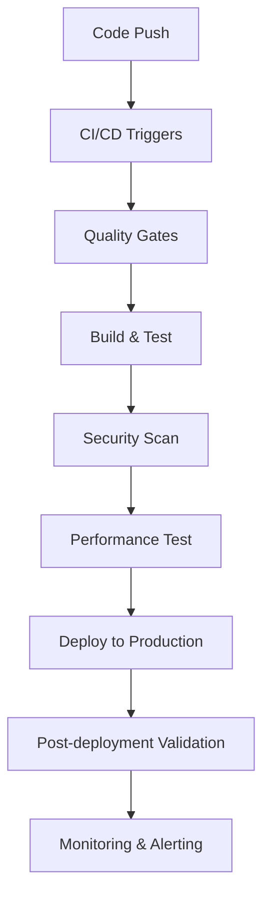

# Infrastructure Documentation

## Overview

This document describes the production-ready infrastructure setup for jayleekr.github.io, including deployment pipelines, monitoring, security, and operational procedures.

## Architecture

### Hosting Platform
- **Platform**: GitHub Pages
- **CDN**: GitHub's built-in CDN with global edge locations
- **SSL**: Automatic SSL/TLS via GitHub Pages
- **Domain**: jayleekr.github.io (GitHub subdomain)

### Build & Deployment Pipeline



## CI/CD Workflows

### 1. Main CI/CD Pipeline (`ci.yml`)
- **Triggers**: Push to master/main, PRs
- **Jobs**:
  - Lint & Type Check
  - Unit Tests with Coverage
  - E2E Tests (Playwright)
  - Accessibility Tests (axe-core)
  - Performance Tests (Lighthouse)
  - Security Audit (CodeQL, npm audit)
  - Quality Gate Validation
  - Build & Deploy (on master only)

### 2. Production Deployment (`production-deploy.yml`)
- **Enhanced Features**:
  - Pre-deployment validation
  - Build analysis and reporting
  - Performance validation
  - Deployment tracking
  - Post-deployment verification
  - Automatic cleanup

### 3. Site Monitoring (`monitoring.yml`)
- **Schedule**: Every 30 minutes
- **Checks**:
  - Uptime monitoring
  - Performance metrics (Lighthouse)
  - Security headers validation
  - Accessibility compliance
  - SSL certificate status
- **Alerting**: Automatic issue creation for critical problems

### 4. Emergency Rollback (`rollback.yml`)
- **Manual Trigger**: Workflow dispatch
- **Options**:
  - Previous deployment rollback
  - Specific commit rollback
  - Emergency maintenance page
- **Features**: Validation, tracking, team notification

## Security Configuration

### Security Headers (`_headers`)
```
Content-Security-Policy: default-src 'self'; script-src 'self' 'unsafe-inline' ...
X-Frame-Options: DENY
X-Content-Type-Options: nosniff
X-XSS-Protection: 1; mode=block
Referrer-Policy: strict-origin-when-cross-origin
```

### Security Features
- **HTTPS Enforcement**: All traffic redirected to HTTPS
- **Security.txt**: RFC 9116 compliant security contact information
- **CodeQL Analysis**: Automated security scanning
- **Dependency Scanning**: Regular vulnerability checks
- **Content Security Policy**: Strict CSP to prevent XSS

## Performance Optimization

### Caching Strategy
```
Static Assets: 1 year (immutable)
Images: 1 week
HTML: 5 minutes
API responses: No cache
Service Worker: No cache (for updates)
```

### Performance Features
- **Asset Optimization**: CSS/JS minification, image optimization
- **Code Splitting**: Intelligent chunk splitting for faster loads
- **CDN**: Global CDN distribution via GitHub Pages
- **Lazy Loading**: Images and non-critical resources
- **Service Worker**: PWA with offline support

### Performance Budgets
- **Lighthouse Score**: ≥90
- **First Contentful Paint**: <1.5s
- **Largest Contentful Paint**: <2.5s
- **Cumulative Layout Shift**: <0.1
- **Time to Interactive**: <3.5s

## Monitoring & Alerting

### Health Checks
- **Uptime**: HTTP 200 response check
- **Performance**: Lighthouse audit scores
- **Security**: Security headers validation
- **Accessibility**: WCAG compliance check
- **SSL**: Certificate validity and configuration

### Alert Thresholds
- **Critical**: Site down, performance <50, security issues
- **Warning**: Performance <90, accessibility issues
- **Info**: SSL expiry warnings, dependency updates

### Monitoring Data
- **Retention**: 90 days for health reports
- **Artifacts**: Performance reports, accessibility audits
- **Logs**: GitHub Actions workflow logs

## Operational Procedures

### Deployment Process
1. **Code Review**: PR review and approval
2. **Quality Gates**: All CI checks must pass
3. **Staging**: Automatic preview deployment
4. **Production**: Automatic deployment on merge to master
5. **Validation**: Post-deployment health checks
6. **Monitoring**: Continuous monitoring activation

### Emergency Procedures

#### Site Down
1. Check monitoring dashboard
2. Verify GitHub Pages status
3. Run emergency rollback if needed
4. Investigate root cause
5. Apply fix and redeploy

#### Performance Degradation
1. Run performance audit
2. Identify bottlenecks
3. Apply optimizations
4. Validate improvements
5. Update performance budgets if needed

#### Security Incident
1. Assess impact and scope
2. Apply immediate mitigations
3. Deploy security patches
4. Notify stakeholders
5. Post-incident review

## Infrastructure as Code

### Configuration Files
- `astro.config.mjs`: Build and runtime configuration
- `public/_headers`: HTTP headers configuration
- `public/.well-known/security.txt`: Security contact info
- `.github/workflows/`: All CI/CD workflows
- `SECURITY.md`: Security policy and procedures

### Environment Variables
- `NODE_ENV`: Development/production environment
- `GITHUB_TOKEN`: Deployment authentication
- `LHCI_GITHUB_APP_TOKEN`: Lighthouse CI token (optional)

## Disaster Recovery

### Backup Strategy
- **Code**: Git repository with full history
- **Deployments**: GitHub Pages deployment history
- **Artifacts**: Build artifacts retained for 30 days
- **Monitoring**: Health reports retained for 90 days

### Recovery Procedures
1. **Rollback**: Use emergency rollback workflow
2. **Rebuild**: Redeploy from clean state
3. **Maintenance**: Emergency maintenance page
4. **Investigation**: Post-incident analysis

### RTO/RPO Targets
- **Recovery Time Objective (RTO)**: 5 minutes
- **Recovery Point Objective (RPO)**: Last commit
- **Mean Time to Recovery (MTTR)**: 10 minutes

## Cost Management

### Resource Usage
- **GitHub Actions**: 2,000 minutes/month free tier
- **GitHub Pages**: Free for public repositories
- **Storage**: 1GB repository limit
- **Bandwidth**: 100GB/month soft limit

### Cost Optimization
- **Efficient Workflows**: Parallel job execution
- **Artifact Cleanup**: Automatic cleanup policies
- **Resource Limits**: Timeout configurations
- **Caching**: Dependency and build caching

## Security Compliance

### Security Standards
- **OWASP**: Top 10 security risks mitigation
- **NIST**: Cybersecurity framework alignment
- **RFC 9116**: Security.txt implementation
- **GDPR**: Privacy by design principles

### Audit Trail
- **Deployments**: Full deployment history
- **Security**: CodeQL scan results
- **Dependencies**: Vulnerability scan reports
- **Access**: GitHub audit logs

## Maintenance Schedule

### Regular Maintenance
- **Dependencies**: Weekly updates (automated via Dependabot)
- **Security**: Daily vulnerability scans
- **Performance**: Weekly performance audits
- **Monitoring**: Continuous health checks

### Quarterly Reviews
- **Security Policy**: Review and update procedures
- **Performance Budgets**: Adjust based on metrics
- **Monitoring Thresholds**: Tune alert sensitivity
- **Infrastructure**: Evaluate new features and improvements

## Contact Information

### Infrastructure Team
- **Primary**: jayleekr@outlook.com
- **GitHub**: @jayleekr
- **Security**: Use GitHub Security Advisories

### Emergency Contacts
- **Critical Issues**: Create GitHub issue with `critical` label
- **Security Issues**: Follow responsible disclosure in `SECURITY.md`
- **General Support**: GitHub Discussions or Issues

## Change Log

| Date | Change | Impact |
|------|--------|---------|
| 2025-01-04 | Initial infrastructure setup | Production-ready deployment |
| 2025-01-04 | Added security headers | Enhanced security posture |
| 2025-01-04 | Implemented monitoring | Proactive issue detection |
| 2025-01-04 | Added rollback procedures | Improved incident response |

---

This infrastructure is designed for reliability, security, and performance. Regular reviews and updates ensure continued effectiveness and alignment with best practices.