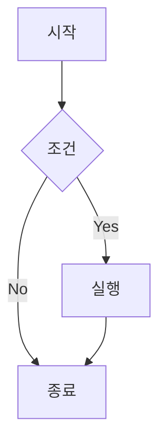
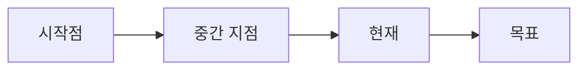

# Blog Style Guide & Templates

## 📎 디자인 시스템

### 색상 팔레트

#### Primary Colors (Blue)
```css
/* Light Mode */
--primary-50: #f0f9ff;
--primary-100: #e0f2fe;
--primary-200: #bae6fd;
--primary-300: #7dd3fc;
--primary-400: #38bdf8;
--primary-500: #0ea5e9;
--primary-600: #0284c7;
--primary-700: #0369a1;
--primary-800: #075985;
--primary-900: #0c4a6e;

/* Dark Mode */
--accent: #60a5fa;      /* primary-400 */
--accent-dark: #93c5fd; /* primary-300 */
```

#### Background Colors
```css
/* Light Mode */
--bg-primary: white;
--bg-secondary: #f9fafb; /* gray-50 */

/* Dark Mode */
--bg-primary: #111827;   /* gray-900 */
--bg-secondary: #1f2937; /* gray-800 */
```

#### Text Colors
```css
/* Light Mode */
--text-primary: #111827;  /* gray-900 */
--text-secondary: #4b5563; /* gray-600 */

/* Dark Mode */
--text-primary: #f9fafb;  /* gray-100 */
--text-secondary: #d1d5db; /* gray-300 */
```

### 타이포그래피

#### Font Families
```css
/* Primary Font Stack */
font-family: 'Inter', 'Noto Sans KR', 'Atkinson', ui-sans-serif, system-ui, sans-serif;

/* Monospace Font Stack */
font-family: 'JetBrains Mono', 'Consolas', 'Monaco', monospace;
```

#### Font Sizes (1.250 ratio scale)
```css
--text-xs: 0.75rem;    /* 12px */
--text-sm: 0.875rem;   /* 14px */
--text-base: 1rem;     /* 16px */
--text-lg: 1.125rem;   /* 18px */
--text-xl: 1.25rem;    /* 20px */
--text-2xl: 1.5rem;    /* 24px */
--text-3xl: 1.875rem;  /* 30px */
--text-4xl: 2.25rem;   /* 36px */
--text-5xl: 3rem;      /* 48px */
--text-6xl: 4rem;      /* 64px */
```

#### Heading Hierarchy
- **H1**: `text-5xl` (48px), `font-weight: 800`, `letter-spacing: -0.05em`
- **H2**: `text-4xl` (36px), `font-weight: 700`
- **H3**: `text-3xl` (30px), `font-weight: 600`
- **H4**: `text-2xl` (24px), `font-weight: 600`
- **H5**: `text-xl` (20px), `font-weight: 500`
- **H6**: `text-lg` (18px), `font-weight: 500`

### 레이아웃 패턴

#### Container Widths
```css
/* Main content */
max-width: 48rem;   /* max-w-3xl = 768px */

/* Blog post */
max-width: 64rem;   /* max-w-4xl = 1024px */

/* Header/Footer */
max-width: 80rem;   /* max-w-6xl = 1280px */
```

#### Spacing
```css
/* Padding */
padding: 1rem 1.5rem;  /* px-4 sm:px-6 lg:px-8 */

/* Margin between sections */
margin-top: 4rem;      /* mt-16 */
margin-bottom: 4rem;   /* mb-16 */

/* Paragraph spacing */
margin-bottom: 1.5rem; /* mb-6 */
```

### 컴포넌트 스타일

#### Buttons
```css
/* Primary Button */
.btn-primary {
  @apply px-6 py-3 bg-primary-600 text-white rounded-lg font-medium;
  @apply hover:bg-primary-700 transition-all duration-200 hover:scale-105;
}

/* Secondary Button */
.btn-secondary {
  @apply px-6 py-3 bg-gray-100 dark:bg-gray-800 text-gray-700 dark:text-gray-300;
  @apply hover:bg-gray-200 dark:hover:bg-gray-700 rounded-lg font-medium transition-all;
}
```

#### Cards
```css
/* Blog Post Card */
.blog-card {
  @apply bg-white dark:bg-gray-800 rounded-lg border border-gray-200 dark:border-gray-700;
  @apply p-6 hover:shadow-lg transition-all duration-300;
  @apply hover:border-primary-300 dark:hover:border-primary-700;
}
```

#### Tags & Categories
```css
/* Category Badge */
.category-badge {
  @apply px-4 py-2 bg-primary-50 dark:bg-primary-900/30 text-primary-700 dark:text-primary-300;
  @apply rounded-lg text-sm font-medium border border-primary-200 dark:border-primary-800;
  @apply hover:bg-primary-100 dark:hover:bg-primary-900/50 transition-colors;
}

/* Tag */
.tag {
  @apply px-3 py-1.5 bg-gray-100 dark:bg-gray-800 text-gray-700 dark:text-gray-300;
  @apply rounded-md text-sm font-medium hover:bg-gray-200 dark:hover:bg-gray-700 transition-colors;
}
```

## 📝 블로그 포스트 템플릿

### 기본 마크다운 템플릿

```markdown
---
title: "포스트 제목"
description: "포스트에 대한 간단한 설명 (SEO와 미리보기에 사용)"
pubDate: 2025-01-28
heroImage: "/assets/img/hero-image.jpg"
categories: ["TechSavvy", "Container"]
tags: ["Docker", "Linux", "Tutorial"]
lang: "ko"
author: "Jay Lee"
readingTime: "10분"
---


# 포스트 제목

## 목차
1. [첫 번째 섹션](#첫-번째-섹션)
2. [두 번째 섹션](#두-번째-섹션)
3. [세 번째 섹션](#세-번째-섹션)

## 첫 번째 섹션

첫 문단은 리드 문단으로 약간 더 크게 표시됩니다. 독자의 관심을 끌 수 있는 내용을 작성하세요.

일반 문단입니다. **볼드체**와 *이탤릭체*를 활용할 수 있습니다.

### 하위 섹션

- 첫 번째 항목
- 두 번째 항목
  - 중첩된 항목
  - 또 다른 중첩된 항목

### 코드 예제

```javascript
// 코드 블록 예제
function hello(name) {
  console.log(`Hello, ${name}!`);
}
```

인라인 코드는 `backtick`으로 감쌉니다.

### 인용구

> 인용구는 이렇게 작성합니다.
> 여러 줄로 작성할 수 있습니다.

### 테이블

| 헤더 1 | 헤더 2 | 헤더 3 |
|--------|--------|--------|
| 내용 1 | 내용 2 | 내용 3 |
| 내용 4 | 내용 5 | 내용 6 |

## 두 번째 섹션

### Mermaid 다이어그램



## 세 번째 섹션

마무리 내용을 작성합니다.

---

**관련 포스트**: 
- [관련 포스트 1](/blog/related-post-1)
- [관련 포스트 2](/blog/related-post-2)
```

### 기술 튜토리얼 템플릿

```markdown
---
title: "[기술명] 완벽 가이드: 제목"
description: "이 튜토리얼에서는 [기술명]을 사용하여 [목표]를 달성하는 방법을 다룹니다"
pubDate: 2025-01-28
heroImage: "/assets/img/tutorial-hero.jpg"
categories: ["TechSavvy", "[하위카테고리]"]
tags: ["Tutorial", "[기술명]", "[관련태그]"]
lang: "ko"
author: "Jay Lee"
readingTime: "15분"
---

# [기술명] 완벽 가이드: 제목

## 🎯 이 튜토리얼에서 배울 내용

- ✅ [학습 목표 1]
- ✅ [학습 목표 2]
- ✅ [학습 목표 3]

## 📋 전제 조건

이 튜토리얼을 따라하기 위해 필요한 것들:

- [도구/환경 1]
- [도구/환경 2]
- 기본적인 [기술] 지식

## 🚀 시작하기

### 1단계: 환경 설정

```bash
# 설치 명령어
npm install [패키지명]
```

### 2단계: 기본 구성

```javascript
// 설정 파일 예제
const config = {
  option1: 'value1',
  option2: 'value2'
};
```

## 💡 핵심 개념

### 개념 1

설명...

### 개념 2

설명...

## 🔧 실습

### 예제 1: 기본 사용법

```javascript
// 코드 예제
```

**설명**: 위 코드는...

### 예제 2: 고급 사용법

```javascript
// 고급 코드 예제
```

## ⚠️ 주의사항

> **중요**: 이 부분은 특히 주의해야 합니다.

## 🐛 문제 해결

### 문제 1: [에러 메시지]

**해결 방법**:
```bash
# 해결 명령어
```

### 문제 2: [다른 에러]

**해결 방법**:
1. 첫 번째 시도
2. 두 번째 시도

## 📚 추가 자료

- [공식 문서](https://example.com)
- [관련 블로그 포스트](/blog/related-post)
- [GitHub 저장소](https://github.com/example/repo)

## 🎉 마무리

이제 [기술명]의 기본을 마스터했습니다! 다음 단계로...

---

**질문이 있으신가요?** 댓글로 남겨주세요!
```

### 회고/일상 포스트 템플릿

```markdown
---
title: "[년도] [분기/월] 회고: 제목"
description: "[기간] 동안의 개발 여정과 배운 점들"
pubDate: 2025-01-28
heroImage: "/assets/img/retrospective.jpg"
categories: ["DeepThinking", "Retrospect"]
tags: ["회고", "성장", "[년도]"]
lang: "ko"
author: "Jay Lee"
readingTime: "8분"
---

# [년도] [분기/월] 회고: 제목

## 🌟 이번 기간의 하이라이트

### 주요 성과
- 🎯 [성과 1]
- 🎯 [성과 2]
- 🎯 [성과 3]

### 숫자로 보는 [기간]
- 완료한 프로젝트: X개
- 작성한 코드 라인: X줄
- 학습한 새로운 기술: X개

## 💻 기술적 성장

### 새로 배운 기술들

#### 1. [기술명]
[학습 경험과 인사이트]

#### 2. [기술명]
[학습 경험과 인사이트]

### 프로젝트 경험

#### [프로젝트명]
- **기간**: [시작일] ~ [종료일]
- **사용 기술**: [기술 스택]
- **배운 점**: [주요 교훈]

## 🤔 깊은 고민들

### [주제 1]
[고민 내용과 결론]

### [주제 2]
[고민 내용과 결론]

## 😅 실패와 교훈

### 실패 1: [실패 경험]
**원인**: [실패 원인]
**교훈**: [배운 점]

### 실패 2: [실패 경험]
**원인**: [실패 원인]
**교훈**: [배운 점]

## 📈 성장 그래프



## 🎯 다음 목표

### 단기 목표 (1-3개월)
- [ ] [목표 1]
- [ ] [목표 2]
- [ ] [목표 3]

### 장기 목표 (6개월-1년)
- [ ] [목표 1]
- [ ] [목표 2]

## 💭 마무리 생각

[개인적인 소감과 다짐]

---

**함께 성장하고 싶으신가요?** 여러분의 회고도 공유해주세요!
```

## 🧩 자주 사용되는 컴포넌트

### 알림 박스 (커스텀 HTML)

```html
<!-- 정보 박스 -->
<div class="bg-blue-50 dark:bg-blue-900/20 border border-blue-200 dark:border-blue-800 rounded-lg p-4 my-6">
  <p class="text-blue-700 dark:text-blue-400 font-medium">
    💡 <strong>팁</strong>: 유용한 정보를 여기에 작성합니다.
  </p>
</div>

<!-- 경고 박스 -->
<div class="bg-yellow-50 dark:bg-yellow-900/20 border border-yellow-200 dark:border-yellow-800 rounded-lg p-4 my-6">
  <p class="text-yellow-700 dark:text-yellow-400 font-medium">
    ⚠️ <strong>주의</strong>: 주의사항을 여기에 작성합니다.
  </p>
</div>

<!-- 에러 박스 -->
<div class="bg-red-50 dark:bg-red-900/20 border border-red-200 dark:border-red-800 rounded-lg p-4 my-6">
  <p class="text-red-700 dark:text-red-400 font-medium">
    ❌ <strong>에러</strong>: 에러 메시지를 여기에 작성합니다.
  </p>
</div>

<!-- 성공 박스 -->
<div class="bg-green-50 dark:bg-green-900/20 border border-green-200 dark:border-green-800 rounded-lg p-4 my-6">
  <p class="text-green-700 dark:text-green-400 font-medium">
    ✅ <strong>성공</strong>: 성공 메시지를 여기에 작성합니다.
  </p>
</div>
```

### 코드 블록 with 파일명

```markdown
```javascript:src/utils/example.js
// 파일명을 포함한 코드 블록
function example() {
  return "Hello World";
}
```
```

### 이미지 with 캡션

```markdown

*이미지 캡션: 설명 텍스트*
```

### 접을 수 있는 섹션 (Details)

```html
<details>
<summary>클릭하여 펼치기</summary>

숨겨진 내용이 여기에 표시됩니다.

```javascript
// 코드도 포함할 수 있습니다
const hidden = true;
```

</details>
```

## 📁 카테고리 구조

### 현재 카테고리 체계

```
blog/
├── TechSavvy/          # 기술 관련
│   ├── AI/             # 인공지능
│   ├── Container/      # 컨테이너 기술
│   ├── EmbeddedLinux/  # 임베디드 리눅스
│   ├── Github/         # GitHub 관련
│   └── ...
├── DeepThinking/       # 깊은 생각
│   ├── Daily/          # 일상
│   ├── Retrospect/     # 회고
│   └── ...
└── Collaboration/      # 협업
    └── ToyProjects/    # 토이 프로젝트
```

### 카테고리별 태그 가이드

- **TechSavvy**: Tutorial, Guide, Tips, Performance, Security
- **DeepThinking**: 회고, 성장, 인사이트, 생각
- **Collaboration**: 오픈소스, 프로젝트, 팀워크

## 🎨 스타일 가이드라인

### 1. 제목 작성 규칙
- 명확하고 구체적으로 작성
- SEO를 고려한 키워드 포함
- 이모지는 제목 시작 부분에만 선택적으로 사용

### 2. 본문 작성 스타일
- 친근하고 대화체 톤 유지
- 기술 용어는 처음 사용 시 설명 추가
- 코드 예제는 실행 가능한 완전한 코드로

### 3. 이미지 사용
- 히어로 이미지: 1920x1080 권장
- 본문 이미지: 최대 너비 1024px
- WebP 포맷 우선 사용
- 의미 있는 alt 텍스트 필수

### 4. 코드 블록
- 언어 명시 필수
- 긴 코드는 주요 부분만 발췌
- 주석으로 설명 추가

### 5. 링크
- 내부 링크는 상대 경로 사용
- 외부 링크는 새 탭에서 열기
- 깨진 링크 정기적으로 확인

## 🚀 반응형 디자인 고려사항

### 모바일 최적화
- 터치 타겟 최소 44px
- 폰트 크기 최소 16px (iOS 줌 방지)
- 가로 스크롤 방지
- 이미지 최대 너비 100vw - 2rem

### 브레이크포인트
- Mobile: < 768px
- Tablet: 768px - 1024px
- Desktop: > 1024px

## 📋 체크리스트

### 새 포스트 작성 시
- [ ] 프론트매터 모든 필드 작성
- [ ] 히어로 이미지 최적화
- [ ] 목차 추가 (긴 포스트)
- [ ] 카테고리와 태그 적절히 설정
- [ ] 모바일에서 미리보기
- [ ] 링크 작동 확인
- [ ] 이미지 alt 텍스트 추가
- [ ] 코드 블록 언어 명시
- [ ] 관련 포스트 링크 추가