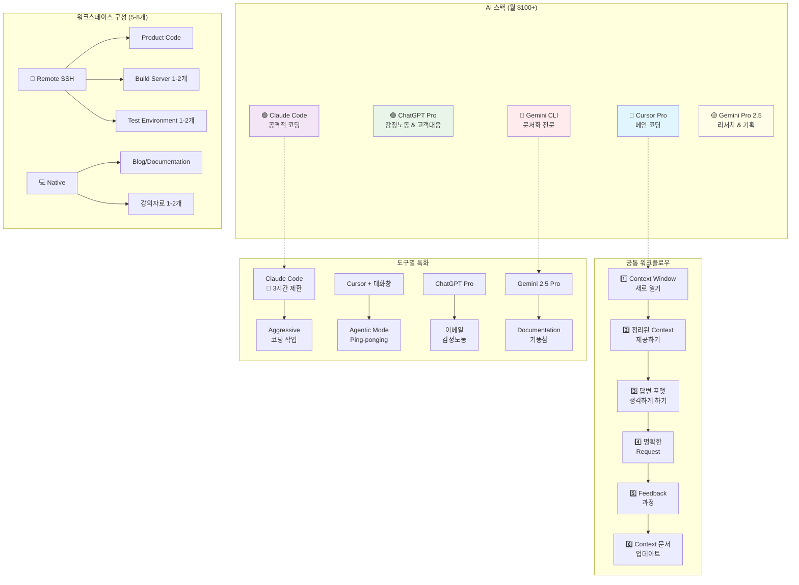

# AI 멀티플렉싱 워크플로우: ADHD급 생산성 향상기 (1)

안녕하세요! 오늘은 좀 다른 이야기를 해보려고 합니다. 

요즘 컴퓨터 앞에 있을 때 진짜 **ADHD도 이런 ADHD가 없다**고 느낄 정도로 여러 AI 도구들을 동시에 돌리고 있어서, 이 혼돈 속에서 나름의 시스템을 찾아가는 과정을 공유해보려고 합니다.

## 🤖 현재 돌리고 있는 AI 스택

매달 **100달러 넘게** 쓰면서 이 녀석들을 매일 돌리고 있습니다:

- **Cursor Pro** - 메인 코딩 환경
- **ChatGPT Pro** - 감정노동과 고객 대응용 (ㅋㅋ)
- **Claude Code** - 공격적인 코딩 작업용
- **Gemini CLI** - 문서화 전문
- **Gemini Pro 2.5** - 리서치 및 새 프로젝트 기획

확실히 많이 쓰기도 하지만, **AI 강의를 매주 하면서** 알게 된 노하우들을 녹여서 쓰다 보니 조금씩 Productivity가 향상됨을 느끼고 있습니다. 

어느 정도 각을 잡아가는 듯해서 이 기록을 남기기로 했습니다.

## 🎯 전체 워크플로우 개요

위 다이어그램이 제가 현재 운영하고 있는 AI 멀티플렉싱 워크플로우의 전체 구조입니다!

## 📋 모든 LLM에게 공통으로 적용하는 워크플로우

경험상 어떤 AI든 상관없이 이 방식으로 일을 시키면 훨씬 좋은 결과가 나옵니다:

### 1. Context Window를 자주 새로 연다
- 길어진 대화는 과감히 정리하고 새 창에서 시작
- 집중력 있는 대화가 훨씬 효과적

### 2. 미리 정리된 Context를 던져서 생각하게 한다
- 바로 답 달라고 하지 말고, 먼저 상황을 파악하게 함
- 키워드 추출부터 시키는 것이 포인트

### 3. 좋은 답변 포맷을 미리 제시하거나 생각하게 한다
- "이런 형태로 답변해줘" 보다는
- "어떤 형태로 답변하는 게 좋을지 먼저 생각해봐"

### 4. 명확한 Request를 한다
- 애매한 요청은 애매한 답변을 낳음
- 구체적이고 측정 가능한 결과물을 요청

### 5. Feedback 과정을 통해 계속 생각하게 만든다
- 한 번에 완벽한 답을 기대하지 말고
- 피드백을 통해 점진적으로 개선

### 6. Context 문서들을 지속적으로 업데이트한다
- project config, workflow 등을 담은 markdown들
- AI가 더 잘 이해할 수 있도록 지속 개선

## 🛠️ 실제 워크스페이스 운영 방식

**모든 Workspace는 git repo로** 만들고 거기서 cursor instance를 띄웁니다. 보통 **5~8개는 떠있어요**:

### Remote Development (SSH 기반)
- **Product Code** (remote dev-container via remote ssh)
- **Production image build server workspace** 1~2개
- **Test environment workspace** 1~2개

### Native Development
- **Blog/Documentation workspace** 
- **강의자료 만드는 workspace** 1~2개 (강의가 여러 개라서...)

## 🎯 도구별 특화 사용법

### Claude Code (100$짜리)
**Aggressive하게 코딩 작업해야 할 Repo** 2개 정도에만 사용합니다. 

> 💸 근데 Claude Code도 **3시간마다 Generated되는 Usage 제한**으로 모자라요... 비싸게 주고도 이런 제약이 있다니 ㅠㅠ

### Cursor + 대화창
뭔가 **대화를 하면서 코드 개선**을 해야 하는 부분은 Agentic Mode나 Ping-ponging으로 작업합니다.

실제 고객사 응대할 때는 **Cursor + Claude Sonnet 4.0** 또는 **Gemini 2.5 Pro**를 가장 많이 씁니다.

### ChatGPT Pro
사실 잘 안 쓰는데 **구독을 끊을까 말까 고민 중**입니다만... 여전히 **고객 대응 시 이메일이나 감정노동**을 담을 때는 진짜 편해요. 이것만으로도 값어치는 하는 듯? ㅋㅋ

### Gemini 2.5 Pro
확실한 건 **2025년 1월 기준 Gemini 2.5 Pro가 Documentation은 기똥차다**는 것입니다.

그래서 문서화 작업할 때는 **Gemini CLI**로 일을 시키는 편입니다.

## 📝 새 프로젝트 시작할 때의 비법

새로운 프로젝트를 시작할 때는 **요구사항 문서 PRD**를 제대로 작성하는 편입니다.

물론 PRD를 내가 다 만들기는 어려우니까, **Gemini 2.5 Pro로 Research**를 돌려서 활용합니다. 들쭉날쭉 일을 잘하기도 하고 못하기도 하는 AI Agent가 조금이나마 더 잘하게 하기 위해 PRD 방법론에 대해 연구시켰어요.

[PRD 방법론 및 템플릿](https://www.notion.so/PRD-22c248114595800487e7efbdb115a8a7?pvs=21)도 만들어뒀으니 관심 있으시면 참고하세요!

## 🔚 마무리하며...

사실 **Claude Code usage가 다시 찰 때까지만** 이 글을 쓰려고 한 거라... ㅋㅋㅋ

다음 글에서는 각 도구별 구체적인 프롬프트 전략이나, 실제 프로젝트에 적용한 사례들을 더 자세히 다뤄보겠습니다.

여러분도 AI 도구들 어떻게 활용하고 계신가요? 댓글로 공유해주세요!

---

*이 글은 실제 AI 도구들을 매일 활용하며 얻은 경험을 바탕으로 작성되었으며, 비슷한 고민을 하는 개발자들에게 도움이 되길 바랍니다.* 