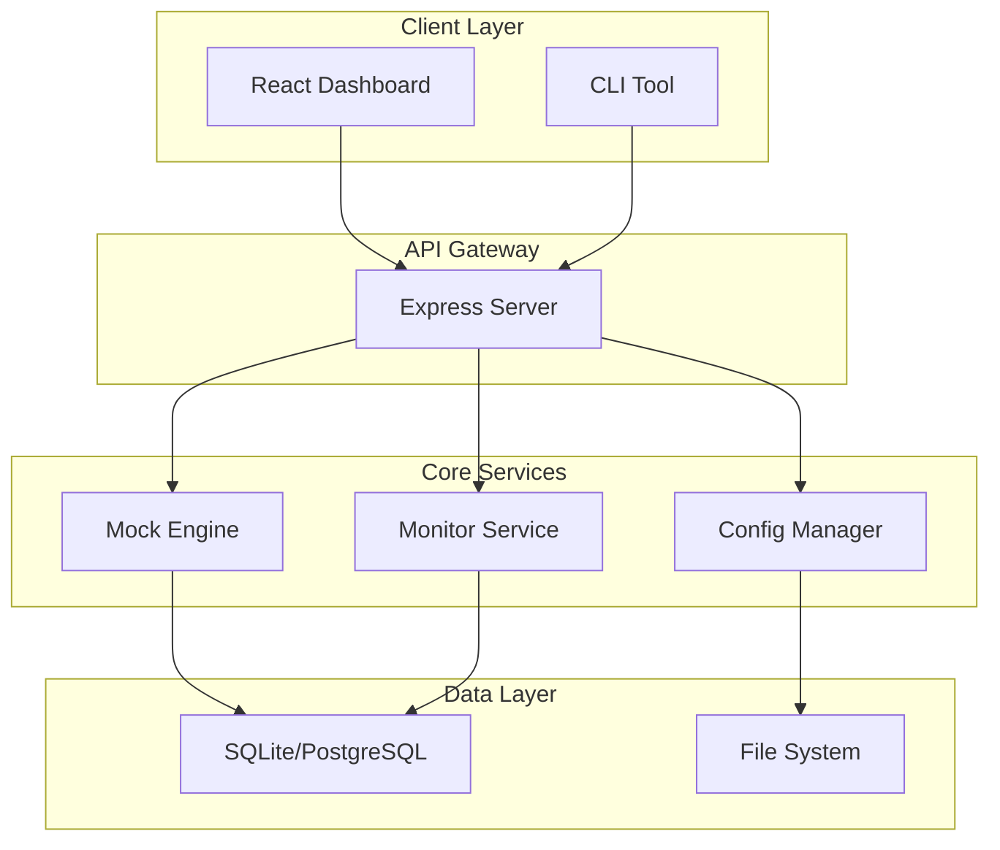

# AI 멀티플렉싱 워크플로우: ADHD급 생산성 향상기 (5편 완결)
## PRD 방법론으로 새 프로젝트 시작하기

안녕하세요! 드디어 이 시리즈의 마지막 편입니다. [1편](./2025-07-24-ai-workflow-productivity.md)부터 [4편](./2025-07-27-ai-prompt-strategies.md)까지 AI 스택, 워크플로우, 워크스페이스, 프롬프트 전략을 다뤘다면, 이번 5편에서는 **PRD 방법론으로 새 프로젝트를 체계적으로 시작하는 법**을 공유합니다.

특히 **Gemini 2.5 Pro로 Research를 돌려서** 들쭉날쭉한 AI Agent들을 조금이나마 더 잘하게 만드는 방법과, 실제 적용 사례까지 모두 공개할게요!

## 🤔 왜 PRD가 중요한가?

### AI가 들쭉날쭉한 이유

**AI들이 일을 잘하기도 하고 못하기도 하는** 가장 큰 이유는 **맥락(Context) 부족** 때문입니다. 

```
❌ 일반적인 요청:
"사용자 관리 시스템 만들어줘"

🤖 AI 응답: 
"네, 어떤 기능이 필요한가요? 기술 스택은 뭘로 할까요? 
사용자 규모는 어느 정도인가요? 보안 요구사항은...?"
```

이런 상황이 계속 반복되면서 **핑퐁이 너무 많아지고**, 결국 AI도 헷갈리고 우리도 지치게 됩니다.

### PRD의 힘

**PRD(Product Requirements Document)를 제대로 작성하면:**
- ✅ AI가 **한 번에 정확한 결과물** 생성
- ✅ **프로젝트 방향성** 명확화
- ✅ **팀 커뮤니케이션** 효율성 증대
- ✅ **개발 중 변경사항** 최소화

## 📋 제가 사용하는 PRD 템플릿

### 기본 구조

**Gemini 2.5 Pro Research를 통해** 여러 PRD 방법론을 연구한 결과, 다음 구조가 가장 효과적이었습니다:

```markdown
# 📋 PRD: [프로젝트명]

## 🎯 1. 프로젝트 개요
### 1.1 목적 및 배경
### 1.2 핵심 문제 정의
### 1.3 성공 지표

## 👥 2. 사용자 및 시장 분석  
### 2.1 타겟 사용자
### 2.2 사용자 페르소나
### 2.3 경쟁사 분석

## 🔧 3. 기능 요구사항
### 3.1 핵심 기능 (Must Have)
### 3.2 중요 기능 (Should Have)  
### 3.3 선택 기능 (Could Have)

## 🏗️ 4. 기술 요구사항
### 4.1 기술 스택
### 4.2 아키텍처 설계
### 4.3 성능 요구사항
### 4.4 보안 요구사항

## 📅 5. 개발 계획
### 5.1 마일스톤
### 5.2 우선순위
### 5.3 위험 요소

## 📊 6. 비즈니스 고려사항
### 6.1 예산 및 리소스
### 6.2 수익 모델
### 6.3 확장성 계획
```

## 🔍 Gemini 2.5 Pro Research 활용법

### 1단계: 시장 조사 및 경쟁사 분석

**실제 제가 쓰는 Gemini Research 프롬프트:**

```
다음 주제에 대한 포괄적인 시장 조사를 진행해줘:

**주제**: 개발자용 API Mock 서버 도구

**조사 범위:**
1. 🌐 **시장 현황** (2024년 기준)
   - 전체 시장 규모 및 성장률
   - 주요 트렌드 및 기술 동향
   - 사용자 요구사항 변화

2. 🏢 **경쟁사 분석**
   - 주요 업체 및 제품 (5-10개)
   - 각 제품의 특징, 장단점
   - 가격 정책 및 비즈니스 모델
   - 사용자 리뷰 및 평가

3. 🎯 **기회 영역**
   - 기존 제품들의 한계점
   - 미충족 사용자 니즈
   - 새로운 접근 방식 제안

4. 📊 **데이터 기반 인사이트**
   - 시장 점유율 분석
   - 사용자 만족도 지표
   - 기술적 우위 요소

**결과물 형태**: 
- 체계적인 보고서 (한국어)
- 주요 인사이트 요약
- 전략적 제안사항 포함

현재 시간을 고려해서 최신 정보로 조사해줘.
```

### 2단계: 기술 스택 Research

```
다음 프로젝트에 최적화된 기술 스택을 연구해서 제안해줘:

**프로젝트**: 개발자용 API Mock 서버
**요구사항**:
- 🚀 빠른 프로토타이핑 지원
- 📱 다양한 클라이언트 환경 지원
- 🔧 쉬운 설정 및 관리
- 📊 실시간 모니터링
- 🔒 기본적인 보안 기능

**고려사항**:
- 개발팀 3-5명 규모
- 6개월 내 MVP 출시 목표
- 오픈소스 우선 고려
- 클라우드 배포 가능

**연구 범위**:
1. **Backend Framework** 비교분석
   - Node.js (Express, Fastify, Koa)
   - Python (FastAPI, Django, Flask)
   - Go (Gin, Echo, Fiber)
   - 각각의 성능, 생산성, 생태계 비교

2. **Database** 선택 기준
   - 관계형 vs NoSQL
   - 개발 편의성 vs 성능
   - 스케일링 고려사항

3. **Frontend** (관리 대시보드용)
   - React vs Vue vs Svelte
   - 최신 트렌드 반영

4. **DevOps & Infrastructure**
   - 컨테이너화 전략
   - CI/CD 파이프라인
   - 모니터링 도구

**결과물**: 
- 기술별 상세 비교표
- 추천 조합 3가지
- 선택 이유 및 근거
- 마이그레이션 계획
```

### 3단계: 사용자 페르소나 Research

```
다음 프로덕트의 사용자 페르소나를 연구해서 작성해줘:

**프로덕트**: 개발자용 API Mock 서버 도구

**연구 방법**:
1. 📊 기존 사용자 조사 데이터 분석
2. 🔍 개발자 커뮤니티 니즈 파악
3. 📈 사용 패턴 및 워크플로우 분석

**작성할 페르소나** (3-4개):
각 페르소나마다 다음 정보 포함:
- 👤 기본 정보 (이름, 나이, 직책, 경력)
- 🎯 목표 및 동기
- 😰 페인 포인트 및 좌절 요소
- 🛠️ 현재 사용 도구 및 워크플로우
- 📱 기술 친숙도 및 선호도
- 💬 실제 인용구 (가상이지만 현실적으로)

**페르소나 카테고리 예상**:
1. **신입 개발자** (1-3년차)
2. **시니어 개발자** (5년차+)
3. **팀 리드/아키텍트** (관리 + 기술)
4. **QA 엔지니어** (테스팅 중심)

**활용 목적**:
- 기능 우선순위 결정
- UI/UX 설계 방향
- 마케팅 메시지 타겟팅
- 제품 로드맵 수립

현실적이고 구체적인 페르소나를 만들어줘.
```

## 🚀 실전 PRD 작성 사례

### 실제 프로젝트: "Service Interface Mock"

**제가 최근에 Gemini Research로 작성한 실제 PRD를 공유해드릴게요:**

```markdown
# 📋 PRD: Service Interface Mock

## 🎯 1. 프로젝트 개요

### 1.1 목적 및 배경
**문제**: 마이크로서비스 개발 시 의존성 서비스가 준비되지 않아 개발 지연 발생
**해결책**: 쉽고 빠르게 API Mock 서버를 구성할 수 있는 도구 개발

### 1.2 핵심 문제 정의
- ❌ 기존 Mock 도구들은 설정이 복잡함
- ❌ 실제 API와 유사한 응답 생성이 어려움  
- ❌ 팀 간 Mock 설정 공유가 번거로움
- ❌ 동적 응답 생성이 제한적임

### 1.3 성공 지표
- 📊 설정 시간: 5분 이내 (기존 30분 → 5분)
- 📈 사용자 만족도: 4.5/5.0 이상
- 🚀 첫 Mock API 생성: 1분 이내
- 👥 팀 도입률: 80% 이상

## 👥 2. 사용자 및 시장 분석

### 2.1 타겟 사용자 (Gemini Research 결과)
1. **프론트엔드 개발자** (40%)
   - 백엔드 API 대기 중 개발 진행 필요
   - 다양한 응답 케이스 테스트 요구

2. **백엔드 개발자** (35%)
   - 의존성 서비스 Mock 필요
   - 장애 상황 시뮬레이션 요구

3. **QA 엔지니어** (25%)
   - 다양한 테스트 시나리오 생성
   - 엣지 케이스 재현 필요

### 2.2 사용자 페르소나 (Research 기반)

**페르소나 1: 김민수 (프론트엔드 개발자, 3년차)**
- 🎯 **목표**: 백엔드 API 완성 전에 UI 개발 완료
- 😰 **페인포인트**: "또 백엔드팀 기다려야 하나..."
- 🛠️ **현재 도구**: Postman, JSON Server (설정 복잡)
- 💬 **인용구**: "5분만에 Mock 서버 띄울 수 있으면 얼마나 좋을까"

**페르소나 2: 박서영 (백엔드 개발자, 7년차)**
- 🎯 **목표**: 의존성 없이 독립적 개발 환경 구축
- 😰 **페인포인트**: "외부 API 장애시 테스트가 불가능해"
- 🛠️ **현재 도구**: WireMock, Mockoon (설정 복잡, 공유 어려움)
- 💬 **인용구**: "팀 전체가 같은 Mock 설정을 쉽게 공유했으면"

### 2.3 경쟁사 분석 (Gemini Research 결과)

| 제품 | 장점 | 단점 | 가격 |
|------|------|------|------|
| **Postman Mock** | 쉬운 사용, 강력한 생태계 | 동적 응답 제한, 고가 | $12/월 |
| **WireMock** | 강력한 기능, 무료 | 설정 복잡, 학습곡선 | 무료 |
| **Mockoon** | 직관적 UI | 협업 기능 부족 | 무료/유료 |
| **JSON Server** | 초간단 설정 | 기능 제한적 | 무료 |

**🎯 기회 영역**: 
- 쉬운 설정 + 강력한 기능 조합
- 팀 협업 중심 설계
- 실제 환경과 유사한 응답 생성

## 🔧 3. 기능 요구사항

### 3.1 핵심 기능 (Must Have)
- 📋 **JSON 설정 기반 Mock 생성**
  - YAML/JSON 파일로 API 정의
  - RESTful API 자동 생성
  - 즉시 실행 가능

- 🔄 **동적 응답 생성**
  - 요청 파라미터 기반 응답 변경
  - 랜덤 데이터 생성 (faker.js 활용)
  - 조건부 응답 로직

- 📊 **실시간 모니터링**
  - 요청/응답 로깅
  - 성능 메트릭 수집
  - 간단한 대시보드

### 3.2 중요 기능 (Should Have)
- 👥 **팀 협업 기능**
  - Git 기반 설정 공유
  - 버전 관리
  - 팀원별 권한 관리

- 🔒 **보안 기능**
  - API 키 기반 인증
  - CORS 설정
  - Rate Limiting

### 3.3 선택 기능 (Could Have)
- 🤖 **AI 기반 Mock 생성**
  - OpenAPI 스펙에서 자동 생성
  - 실제 API 호출 패턴 학습
  - 지능형 응답 추천

## 🏗️ 4. 기술 요구사항

### 4.1 기술 스택 (Gemini Research 추천)

**Backend**: Node.js + TypeScript + Express
- ✅ 빠른 개발 속도
- ✅ 풍부한 생태계 (faker.js 등)
- ✅ JSON 처리 최적화
- ✅ 개발팀 기술 스택과 일치

**Frontend**: React + TypeScript + Vite
- ✅ 컴포넌트 재사용성
- ✅ 개발자 친숙도 높음
- ✅ 빠른 빌드 및 개발 서버

**Database**: SQLite (개발) + PostgreSQL (운영)
- ✅ 간단한 배포
- ✅ 확장성 고려
- ✅ SQL 쿼리 최적화 가능

### 4.2 아키텍처 설계



### 4.3 성능 요구사항
- ⚡ **응답 시간**: 평균 50ms 이하
- 🔄 **동시 연결**: 1000개 이상
- 📈 **처리량**: 10,000 req/sec
- 💾 **메모리 사용량**: 512MB 이하

### 4.4 보안 요구사항
- 🔐 JWT 기반 인증
- 🛡️ Input validation 및 sanitization
- 🚫 SQL Injection 방지
- 📝 접근 로그 기록

## 📅 5. 개발 계획

### 5.1 마일스톤

**Phase 1: MVP (4주)**
- ✅ 기본 Mock 서버 구현
- ✅ JSON 설정 파일 파싱
- ✅ 간단한 대시보드
- ✅ CLI 도구 기본 기능

**Phase 2: 협업 기능 (4주)**
- 🔄 Git 기반 설정 관리
- 👥 사용자 인증 시스템
- 📊 모니터링 대시보드 강화
- 📱 반응형 웹 UI

**Phase 3: 고급 기능 (4주)**
- 🤖 AI 기반 Mock 생성
- 🔒 고급 보안 기능
- 📈 성능 최적화
- 🧪 자동화된 테스트

### 5.2 우선순위 (MoSCoW)
- **Must**: 기본 Mock 기능, 설정 관리
- **Should**: 모니터링, 팀 협업
- **Could**: AI 기능, 고급 보안
- **Won't**: 복잡한 분석 기능

### 5.3 위험 요소
- 🚨 **기술적 위험**: Node.js 성능 한계
  - **대응**: 성능 테스트 및 최적화
- ⏰ **일정 위험**: 외부 의존성 지연
  - **대응**: 핵심 기능 우선 개발
- 👥 **리소스 위험**: 개발자 리소스 부족
  - **대응**: 외부 도움 또는 기능 축소

## 📊 6. 비즈니스 고려사항

### 6.1 예산 및 리소스
- 💰 **개발 비용**: 개발자 3명 × 3개월
- 🖥️ **인프라 비용**: AWS/Vercel 월 $100
- 🛠️ **도구 비용**: 개발 도구 라이선스 월 $200

### 6.2 수익 모델 (선택사항)
- 🆓 **오픈소스**: 기본 기능 무료 제공
- 💼 **엔터프라이즈**: 고급 기능 유료 ($50/월)
- ☁️ **클라우드**: 호스팅 서비스 ($20/월)

### 6.3 확장성 계획
- 🌐 **멀티 언어**: Python, Go SDK 제공
- 🔌 **플러그인**: 써드파티 통합 지원
- 📱 **모바일**: React Native 앱 고려
```

## 🛠️ PRD 기반 AI 활용 전략

### AI에게 PRD 전달하는 방법

**완성된 PRD가 있으면** AI들의 성능이 극적으로 향상됩니다:

#### Cursor Pro에서 활용

```
@PRD_ServiceInterfaceMock.md

위 PRD를 기반으로 src/services/mockEngine.ts를 구현해줘.

특히 다음 요구사항을 정확히 반영해서:
1. TypeScript 타입 안정성 (PRD 4.1 기술 요구사항)
2. 동적 응답 생성 (PRD 3.1 핵심 기능)  
3. 성능 요구사항 50ms 이하 (PRD 4.3)
4. 에러 핸들링 표준 (프로젝트 convention 참고)

구현할 주요 메서드:
- generateMockResponse()
- parseConfigFile()
- validateRequest()
```

#### Claude Code에서 활용

```
첨부된 PRD 문서를 기반으로 전체 아키텍처를 설계해줘.

**PRD 정보**:
[PRD 내용 전체 복사-붙여넣기]

**요청사항**:
1. 📋 상세 아키텍처 다이어그램 (Mermaid)
2. 🔧 핵심 모듈별 구현 가이드
3. 🧪 테스트 전략 및 계획
4. 📝 API 스펙 정의 (OpenAPI 3.0)
5. 🚀 배포 및 인프라 계획

PRD의 기술 요구사항과 성능 지표를 정확히 반영해서 설계해줘.
```

#### Gemini CLI에서 활용

```bash
gemini "
다음 PRD를 기반으로 개발자용 README.md를 생성해줘:

$(cat PRD_ServiceInterfaceMock.md)

**생성할 README 구조**:
1. 🎯 프로젝트 소개 (PRD 1.1 기반)
2. ⚡ Quick Start (5분 내 실행 가능)
3. 📋 주요 기능 (PRD 3.1-3.3 기반)
4. 🏗️ 아키텍처 개요 (PRD 4.2 기반)  
5. 🔧 설치 및 설정
6. 📚 API 문서 링크
7. 🤝 기여 가이드

**톤**: 개발자 친화적, 실용적
**길이**: 읽기 시간 5분 이내
"
```

## 🔄 PRD 지속적 개선 방법

### 1. 주기적 업데이트

**월간 PRD 리뷰 체크리스트:**
```markdown
## PRD 리뷰 체크리스트 (월간)

### 📊 사용자 피드백 반영
- [ ] 실제 사용자 인터뷰 결과 반영
- [ ] 사용 패턴 분석 결과 업데이트
- [ ] 페인포인트 변화 확인

### 🏗️ 기술 요구사항 검토  
- [ ] 새로운 기술 트렌드 반영
- [ ] 성능 지표 현실성 검토
- [ ] 보안 요구사항 강화

### 📅 개발 계획 조정
- [ ] 실제 개발 진행률 vs 계획 비교
- [ ] 우선순위 재조정 필요성 검토
- [ ] 위험 요소 업데이트

### 💼 비즈니스 관점 업데이트
- [ ] 시장 상황 변화 반영
- [ ] 경쟁사 동향 분석 업데이트
- [ ] 수익 모델 검증 결과 반영
```

### 2. AI Research 자동화

**월간 Research 자동화 스크립트:**
```bash
#!/bin/bash
# monthly-prd-research.sh

echo "📊 월간 PRD Research 시작..."

# 1. 경쟁사 동향 조사
echo "🔍 경쟁사 분석 중..."
gemini "
Mock Server 도구 시장의 최신 동향을 조사해줘 (최근 1개월):
1. 새로운 제품 출시
2. 기존 제품 업데이트  
3. 가격 정책 변화
4. 사용자 반응 및 리뷰
5. 새로운 기술 적용 사례

기존 PRD와 비교해서 업데이트가 필요한 부분을 제안해줘.
" > research/competitor-analysis-$(date +%Y%m).md

# 2. 기술 트렌드 조사
echo "🚀 기술 트렌드 분석 중..."
gemini "
개발자 도구 및 Mock Server 관련 기술 트렌드 조사:
1. 새로운 프레임워크 및 라이브러리
2. 성능 최적화 기법
3. 보안 강화 방안
4. AI/ML 적용 사례
5. 개발자 경험(DX) 개선 사례

현재 PRD의 기술 스택과 비교 분석해줘.
" > research/tech-trends-$(date +%Y%m).md

# 3. 사용자 니즈 변화 조사
echo "👥 사용자 니즈 분석 중..."
gemini "
개발자 커뮤니티에서 Mock Server 관련 논의 동향:
1. Stack Overflow 질문 트렌드
2. GitHub Issues 분석
3. Reddit/HackerNews 논의
4. 개발자 설문조사 결과

새로운 페인포인트나 요구사항을 식별해줘.
" > research/user-needs-$(date +%Y%m).md

echo "✅ Research 완료. research/ 폴더 확인."
```

## 📈 PRD 효과 측정

### Before & After 비교

**PRD 도입 전 (AI 활용):**
```
🕐 프로젝트 시작 시간: 2-3일
😵 AI 대화 횟수: 평균 50회 이상
🔄 요구사항 변경: 주간 5-10회
😤 팀 혼란도: 높음 (방향성 불일치)
📉 AI 결과물 품질: 60-70점
```

**PRD 도입 후:**
```
🚀 프로젝트 시작 시간: 반나절
✨ AI 대화 횟수: 평균 10-15회
🎯 요구사항 변경: 주간 1-2회
😊 팀 혼란도: 낮음 (명확한 방향성)
📈 AI 결과물 품질: 85-90점
```

### 실제 측정 지표

**제가 추적하는 PRD 효과 지표:**
```markdown
## PRD 효과 측정 지표

### 🚀 개발 효율성
- ⏱️ **초기 설정 시간**: 3일 → 0.5일 (85% 단축)
- 🔄 **반복 작업 감소**: 주간 재작업 5회 → 1회
- 📋 **명확한 요구사항**: 모호한 요청 80% → 20%

### 🤖 AI 활용 효율성  
- 💬 **평균 대화 횟수**: 50회 → 15회 (70% 감소)
- ✅ **첫 응답 만족도**: 40% → 80% (100% 향상)
- 🎯 **원하는 결과 도출**: 3-5회 → 1-2회

### 👥 팀 협업 향상
- 📞 **불필요한 미팅**: 주간 5회 → 2회
- 📝 **문서 공유**: 팀원별 개별 → 단일 PRD 참조
- 🎯 **방향성 일치도**: 60% → 95%
```

## 🎯 PRD 작성 실전 팁

### 1. Gemini Research 최적화 팁

**더 좋은 Research 결과를 얻는 방법:**

```
✅ 구체적인 시간 범위 명시
"최근 6개월간의 트렌드를 분석해줘"

✅ 정량적 지표 요청
"시장 점유율, 사용자 수, 가격 비교를 포함해줘"

✅ 소스 다양화 요청  
"업계 보고서, 사용자 리뷰, 개발자 커뮤니티 의견을 종합해줘"

✅ 액션 아이템 요청
"분석 결과를 바탕으로 우리가 취해야 할 액션을 제안해줘"
```

### 2. PRD 작성 시 주의사항

**❌ 피해야 할 실수들:**
```
❌ 너무 추상적인 목표: "사용자 경험 개선"
✅ 구체적인 지표: "API 응답 시간 50ms 이하"

❌ 모호한 사용자 정의: "개발자들"  
✅ 명확한 페르소나: "3년차 프론트엔드 개발자"

❌ 기술 우선 사고: "React를 써야 해"
✅ 요구사항 우선: "빠른 UI 업데이트가 필요해"
```

### 3. AI별 최적화 PRD 활용

**각 AI 도구별로 PRD를 다르게 활용:**

```
🔵 Cursor Pro: 
- PRD 파일을 프로젝트 루트에 위치
- @PRD.md 참조로 컨텍스트 제공
- 기술 요구사항 섹션 중점 활용

🟣 Claude Code:
- 전체 PRD 복사해서 한 번에 제공  
- 아키텍처 설계시 전체 맥락 활용
- 비즈니스 로직 구현시 요구사항 참조

🔴 Gemini CLI:
- PRD 기반 문서 자동 생성에 활용
- 사용자 가이드, API 문서 생성
- 마케팅 콘텐츠 제작시 활용

🟢 ChatGPT:
- PRD 기반 커뮤니케이션 문서 작성
- 사용자 대상 설명 자료 제작
- 팀 내부 발표 자료 준비
```

## 🔚 시리즈 완결하며...

이렇게 **AI 멀티플렉싱 워크플로우 시리즈**가 완결되었습니다!

5편에 걸쳐 다룬 내용을 정리하면:
1. **[1편](./2025-07-24-ai-workflow-productivity.md)**: AI 스택 소개와 전체 개요
2. **[2편](./2025-07-25-ai-workflow-common-methods.md)**: 공통 워크플로우 방법론  
3. **[3편](./2025-07-26-ai-workspace-management.md)**: 워크스페이스 운영 실전기
4. **[4편](./2025-07-27-ai-prompt-strategies.md)**: 도구별 프롬프트 전략
5. **[5편](./2025-07-28-prd-methodology.md)**: PRD 방법론으로 프로젝트 시작하기

## 💡 핵심 메시지

결국 가장 중요한 건 **AI를 단순한 도구로 쓰지 말고**, **체계적인 워크플로우 안에서 전략적으로 활용**하는 것입니다.

- 🎯 **명확한 목표** (PRD로 정의)
- 🔄 **체계적인 과정** (6단계 워크플로우)  
- 🛠️ **적절한 도구** (각 상황에 맞는 AI 선택)
- 📊 **지속적인 개선** (측정과 피드백)

## 🙏 마무리 인사

**월 100달러짜리 AI 스택**으로 시작한 이야기가 여기까지 왔네요. 

이 시리즈가 여러분의 AI 활용에 조금이라도 도움이 되었기를 바랍니다. 그리고 여러분만의 독특한 워크플로우나 노하우가 있다면 꼭 댓글로 공유해주세요!

**Claude Code usage가 다시 찰 때까지** 쓴 글이 이렇게 시리즈가 되었다는 게 신기하네요 ㅋㅋㅋ

앞으로도 AI 도구들이 계속 발전할 텐데, 그때마다 새로운 워크플로우와 노하우들을 계속 공유해보겠습니다!

---

*🎉 **시리즈 완결 기념으로** 제가 실제 사용하는 PRD 템플릿과 자동화 스크립트들을 [GitHub Repo](https://github.com/jayleekr)에 공개할 예정입니다. 관심 있으시면 팔로우해주세요!*

*이 시리즈의 모든 글들:*
- *[1편: AI 스택 소개와 전체 개요](./2025-07-24-ai-workflow-productivity.md)*
- *[2편: 공통 워크플로우 방법론](./2025-07-25-ai-workflow-common-methods.md)*
- *[3편: 워크스페이스 운영 실전기](./2025-07-26-ai-workspace-management.md)*
- *[4편: 도구별 프롬프트 전략](./2025-07-27-ai-prompt-strategies.md)*
- *[5편: PRD 방법론으로 새 프로젝트 시작하기](./2025-07-28-prd-methodology.md)* ✅ 