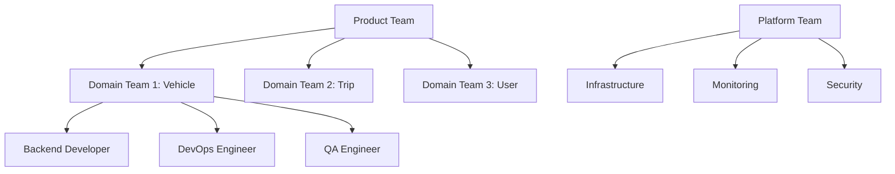

# 실전 마이크로서비스 아키텍처: Kubernetes로 확장 가능한 시스템 구축하기

> **TL;DR**: 자율주행 차량 플랫폼에서 100만+ 요청/분을 처리하는 마이크로서비스 아키텍처를 Kubernetes로 구축한 실제 경험. 설계 원칙부터 운영 노하우까지 실무에서 바로 적용할 수 있는 가이드.

## 들어가며: 왜 마이크로서비스인가?

2년 전, 모놀리식 구조로 시작한 차량 데이터 플랫폼이 성장의 한계에 부딪혔습니다:

- **배포 시간**: 30분 → **목표**: 5분 이내
- **서비스 장애**: 전체 시스템 다운 → **목표**: 부분 격리
- **개발 생산성**: 팀 간 의존성 높음 → **목표**: 독립적 개발

이 문제를 해결하기 위해 마이크로서비스 전환을 결정했고, 1년간의 여정을 통해 얻은 실무 경험을 공유합니다.

## 아키텍처 설계 원칙

### 🎯 도메인 기반 서비스 분할

**잘못된 접근** (기술 계층별 분할):
```
❌ database-service
❌ api-service  
❌ auth-service
❌ notification-service
```

**올바른 접근** (비즈니스 도메인별 분할):
```
✅ vehicle-management
✅ trip-analytics
✅ user-profiles
✅ billing-payments
```

#### 실제 도메인 분할 사례

```typescript
// 자율주행 플랫폼의 도메인 분할
interface DomainBoundaries {
  vehicleFleet: {
    responsibilities: ['차량 등록', '상태 모니터링', '펌웨어 관리'];
    dataOwnership: ['vehicles', 'sensors', 'diagnostics'];
    apis: ['/vehicles', '/fleet/status', '/diagnostics'];
  };
  
  tripManagement: {
    responsibilities: ['여행 생성', '경로 최적화', '실시간 추적'];
    dataOwnership: ['trips', 'routes', 'locations'];
    apis: ['/trips', '/routes', '/tracking'];
  };
  
  userExperience: {
    responsibilities: ['사용자 인터페이스', '알림', '피드백'];
    dataOwnership: ['users', 'preferences', 'feedback'];
    apis: ['/users', '/notifications', '/feedback'];
  };
}
```

### 📊 데이터 일관성 전략

#### 이벤트 소싱 패턴 구현

```typescript
// 이벤트 기반 데이터 동기화
interface DomainEvent {
  eventId: string;
  aggregateId: string;
  eventType: string;
  timestamp: Date;
  version: number;
  data: any;
}

class VehicleEventHandler {
  async handleTripCompleted(event: DomainEvent) {
    const { tripId, vehicleId, mileage, fuelConsumption } = event.data;
    
    // 1. Vehicle Service: 차량 상태 업데이트
    await this.vehicleService.updateMileage(vehicleId, mileage);
    
    // 2. Analytics Service: 주행 데이터 저장
    await this.analyticsService.recordTripData({
      tripId, vehicleId, mileage, fuelConsumption
    });
    
    // 3. Billing Service: 요금 계산 이벤트 발행  
    await this.eventPublisher.publish('billing.calculate', {
      tripId, mileage, userId: event.data.userId
    });
  }
}
```

#### SAGA 패턴으로 분산 트랜잭션 관리

```yaml
# trip-booking-saga.yml
saga:
  name: "TripBookingSaga"
  steps:
    - service: "user-service"
      action: "reserve-credits"
      compensate: "release-credits"
      
    - service: "vehicle-service"  
      action: "reserve-vehicle"
      compensate: "release-vehicle"
      
    - service: "trip-service"
      action: "create-trip"
      compensate: "cancel-trip"
      
    - service: "notification-service"
      action: "send-confirmation"
      compensate: "send-cancellation"
```

## Kubernetes 클러스터 구성

### 🏗️ 인프라 아키�ecture

```yaml
# cluster-architecture.yml
apiVersion: v1
kind: ConfigMap
metadata:
  name: cluster-config
data:
  # 프로덕션 클러스터 구성
  nodes: |
    master-nodes: 3 (HA 구성)
    worker-nodes: 12 (auto-scaling)
    
  resources:
    cpu: "48 cores per node"
    memory: "192GB per node"
    storage: "2TB NVMe SSD"
    
  networking:
    cni: "Calico"
    service-mesh: "Istio"
    ingress: "NGINX + Cert-Manager"
```

### 📦 서비스별 배포 설정

#### 1. 고가용성 서비스 (Vehicle Management)

```yaml
# vehicle-service-deployment.yml
apiVersion: apps/v1
kind: Deployment
metadata:
  name: vehicle-service
  labels:
    app: vehicle-service
    version: v2.1.3
spec:
  replicas: 5
  strategy:
    type: RollingUpdate
    rollingUpdate:
      maxSurge: 2
      maxUnavailable: 1
  selector:
    matchLabels:
      app: vehicle-service
  template:
    metadata:
      labels:
        app: vehicle-service
        version: v2.1.3
    spec:
      containers:
      - name: vehicle-service
        image: myregistry/vehicle-service:v2.1.3
        ports:
        - containerPort: 8080
        env:
        - name: DATABASE_URL
          valueFrom:
            secretKeyRef:
              name: db-credentials
              key: url
        - name: REDIS_URL
          valueFrom:
            configMapKeyRef:
              name: cache-config
              key: redis-url
        resources:
          requests:
            memory: "512Mi"
            cpu: "250m"
          limits:
            memory: "1Gi"
            cpu: "500m"
        livenessProbe:
          httpGet:
            path: /health
            port: 8080
          initialDelaySeconds: 30
          periodSeconds: 10
        readinessProbe:
          httpGet:
            path: /ready
            port: 8080
          initialDelaySeconds: 15
          periodSeconds: 5
---
apiVersion: v1
kind: Service
metadata:
  name: vehicle-service
spec:
  selector:
    app: vehicle-service
  ports:
  - port: 80
    targetPort: 8080
  type: ClusterIP
```

#### 2. HPA (Horizontal Pod Autoscaler) 설정

```yaml
# vehicle-service-hpa.yml
apiVersion: autoscaling/v2
kind: HorizontalPodAutoscaler
metadata:
  name: vehicle-service-hpa
spec:
  scaleTargetRef:
    apiVersion: apps/v1
    kind: Deployment
    name: vehicle-service
  minReplicas: 3
  maxReplicas: 20
  metrics:
  - type: Resource
    resource:
      name: cpu
      target:
        type: Utilization
        averageUtilization: 70
  - type: Resource
    resource:
      name: memory
      target:
        type: Utilization
        averageUtilization: 80
  - type: Pods
    pods:
      metric:
        name: requests_per_second
      target:
        type: AverageValue
        averageValue: "100"
```

### 🔄 CI/CD 파이프라인

#### GitOps 기반 배포 자동화

```yaml
# .github/workflows/deploy.yml
name: Deploy to Kubernetes
on:
  push:
    branches: [main]
    
jobs:
  test:
    runs-on: ubuntu-latest
    steps:
    - uses: actions/checkout@v3
    - name: Run Tests
      run: |
        npm test
        npm run test:integration
        
  security-scan:
    runs-on: ubuntu-latest
    steps:
    - name: Security Scan
      run: |
        docker run --rm -v $(pwd):/app \
          aquasec/trivy fs /app
          
  deploy:
    needs: [test, security-scan]
    runs-on: ubuntu-latest
    steps:
    - name: Deploy to Staging
      run: |
        kubectl apply -f k8s/staging/
        kubectl wait --for=condition=ready pod \
          -l app=vehicle-service --timeout=300s
          
    - name: Run E2E Tests
      run: |
        npm run test:e2e:staging
        
    - name: Deploy to Production
      if: success()
      run: |
        kubectl apply -f k8s/production/
        kubectl rollout status deployment/vehicle-service
```

## 서비스 메시(Service Mesh) 구현

### 🕸️ Istio로 트래픽 관리

#### 카나리 배포 설정

```yaml
# canary-deployment.yml
apiVersion: networking.istio.io/v1beta1
kind: VirtualService
metadata:
  name: vehicle-service-canary
spec:
  hosts:
  - vehicle-service
  http:
  - match:
    - headers:
        canary:
          exact: "true"
    route:
    - destination:
        host: vehicle-service
        subset: v2
  - route:
    - destination:
        host: vehicle-service
        subset: v1
      weight: 90
    - destination:
        host: vehicle-service
        subset: v2
      weight: 10
---
apiVersion: networking.istio.io/v1beta1
kind: DestinationRule
metadata:
  name: vehicle-service-destination
spec:
  host: vehicle-service
  subsets:
  - name: v1
    labels:
      version: v2.1.2
  - name: v2
    labels:
      version: v2.1.3
  trafficPolicy:
    loadBalancer:
      simple: LEAST_CONN
```

#### 회로 차단기(Circuit Breaker) 패턴

```yaml
# circuit-breaker.yml
apiVersion: networking.istio.io/v1beta1
kind: DestinationRule
metadata:
  name: trip-service-circuit-breaker
spec:
  host: trip-service
  trafficPolicy:
    outlierDetection:
      consecutiveErrors: 3
      interval: 30s
      baseEjectionTime: 30s
      maxEjectionPercent: 50
    connectionPool:
      tcp:
        maxConnections: 100
      http:
        http1MaxPendingRequests: 50
        maxRequestsPerConnection: 10
        maxRetries: 3
        connectTimeout: 30s
```

## 모니터링과 관찰성(Observability)

### 📊 통합 모니터링 스택

```yaml
# monitoring-stack.yml
apiVersion: v1
kind: ConfigMap
metadata:
  name: monitoring-config
data:
  prometheus.yml: |
    global:
      scrape_interval: 15s
    scrape_configs:
    - job_name: 'kubernetes-pods'
      kubernetes_sd_configs:
      - role: pod
      relabel_configs:
      - source_labels: [__meta_kubernetes_pod_annotation_prometheus_io_scrape]
        action: keep
        regex: true
        
  grafana-dashboard.json: |
    {
      "dashboard": {
        "title": "Microservices Overview",
        "panels": [
          {
            "title": "Request Rate",
            "type": "graph",
            "targets": [
              {
                "expr": "rate(http_requests_total[5m])",
                "legendFormat": "{{service}}"
              }
            ]
          },
          {
            "title": "Error Rate",
            "type": "singlestat",
            "targets": [
              {
                "expr": "rate(http_requests_total{status=~'5..'}[5m]) / rate(http_requests_total[5m])",
                "legendFormat": "Error Rate %"
              }
            ]
          }
        ]
      }
    }
```

### 🔍 분산 추적(Distributed Tracing)

```typescript
// OpenTelemetry 계측 예제
import { trace, SpanStatusCode } from '@opentelemetry/api';
import { NodeSDK } from '@opentelemetry/auto-instrumentations-node';

class TripService {
  private tracer = trace.getTracer('trip-service');
  
  async createTrip(tripData: CreateTripRequest): Promise<Trip> {
    const span = this.tracer.startSpan('create-trip');
    
    try {
      span.setAttributes({
        'trip.user_id': tripData.userId,
        'trip.vehicle_id': tripData.vehicleId,
        'trip.route_length': tripData.routeLength
      });
      
      // 1. 사용자 크레딧 확인
      const creditSpan = this.tracer.startSpan('check-user-credits', { parent: span });
      const hasCredits = await this.userService.checkCredits(tripData.userId);
      creditSpan.end();
      
      if (!hasCredits) {
        span.recordException(new Error('Insufficient credits'));
        span.setStatus({ code: SpanStatusCode.ERROR });
        throw new InsufficientCreditsError();
      }
      
      // 2. 차량 예약
      const vehicleSpan = this.tracer.startSpan('reserve-vehicle', { parent: span });
      await this.vehicleService.reserveVehicle(tripData.vehicleId);
      vehicleSpan.end();
      
      // 3. 여행 생성
      const trip = await this.tripRepository.create(tripData);
      
      span.setAttributes({
        'trip.id': trip.id,
        'trip.status': trip.status
      });
      
      span.setStatus({ code: SpanStatusCode.OK });
      return trip;
      
    } catch (error) {
      span.recordException(error);
      span.setStatus({ code: SpanStatusCode.ERROR });
      throw error;
    } finally {
      span.end();
    }
  }
}
```

## 성능 최적화 전략

### ⚡ 캐싱 전략

#### 다계층 캐싱 구현

```typescript
// 스마트 캐싱 시스템
interface CacheStrategy {
  l1: 'in-memory'; // 애플리케이션 레벨 (100ms TTL)
  l2: 'redis';     // 클러스터 레벨 (5min TTL) 
  l3: 'database';  // 영구 저장소
}

class VehicleLocationService {
  private memoryCache = new Map();
  private redisClient: Redis;
  
  async getVehicleLocation(vehicleId: string): Promise<Location> {
    // L1: 메모리 캐시 확인
    const memCached = this.memoryCache.get(vehicleId);
    if (memCached && this.isValid(memCached, 100)) {
      return memCached.data;
    }
    
    // L2: Redis 캐시 확인  
    const redisCached = await this.redisClient.get(`location:${vehicleId}`);
    if (redisCached) {
      const data = JSON.parse(redisCached);
      this.memoryCache.set(vehicleId, { data, timestamp: Date.now() });
      return data;
    }
    
    // L3: 데이터베이스 조회
    const location = await this.locationRepository.findByVehicleId(vehicleId);
    
    // 캐시에 저장 (상위 레벨로)
    await this.redisClient.setex(`location:${vehicleId}`, 300, JSON.stringify(location));
    this.memoryCache.set(vehicleId, { data: location, timestamp: Date.now() });
    
    return location;
  }
}
```

#### 데이터베이스 최적화

```sql
-- 인덱스 최적화 예제
-- 복합 인덱스로 조회 성능 개선
CREATE INDEX CONCURRENTLY idx_trips_user_status_date 
ON trips(user_id, status, created_at DESC);

-- 파티셔닝으로 대용량 데이터 관리
CREATE TABLE trips_2024_q1 PARTITION OF trips 
FOR VALUES FROM ('2024-01-01') TO ('2024-04-01');

-- 읽기 전용 복제본 활용
-- application.yml
spring:
  datasource:
    master:
      url: jdbc:postgresql://master-db:5432/trips
    slave:
      url: jdbc:postgresql://readonly-db:5432/trips
```

### 📈 오토스케일링 최적화

#### 사용자 정의 메트릭 기반 스케일링

```yaml
# custom-metrics-hpa.yml
apiVersion: autoscaling/v2
kind: HorizontalPodAutoscaler
metadata:
  name: vehicle-service-custom-hpa
spec:
  scaleTargetRef:
    apiVersion: apps/v1
    kind: Deployment
    name: vehicle-service
  minReplicas: 3
  maxReplicas: 50
  metrics:
  # 큐 길이 기반 스케일링
  - type: External
    external:
      metric:
        name: rabbitmq_queue_messages
        selector:
          matchLabels:
            queue: "vehicle-updates"
      target:
        type: AverageValue
        averageValue: "30"
  # 응답 시간 기반 스케일링        
  - type: Pods
    pods:
      metric:
        name: http_request_duration_95percentile
      target:
        type: AverageValue
        averageValue: "500m"  # 500ms
```

## 장애 대응과 복구 전략

### 🚨 장애 시나리오별 대응

#### 1. 서비스 간 통신 장애

```typescript
// Retry 정책과 Circuit Breaker
import { CircuitBreaker } from 'opossum';

class VehicleApiClient {
  private circuitBreaker: CircuitBreaker;
  
  constructor() {
    const options = {
      timeout: 3000,
      errorThresholdPercentage: 50,
      resetTimeout: 30000,
      rollingCountTimeout: 10000,
      rollingCountBuckets: 10
    };
    
    this.circuitBreaker = new CircuitBreaker(this.callVehicleAPI.bind(this), options);
    
    // 폴백 전략
    this.circuitBreaker.fallback(() => {
      return this.getCachedVehicleData() || this.getDefaultVehicleData();
    });
  }
  
  async getVehicleData(vehicleId: string): Promise<VehicleData> {
    try {
      return await this.circuitBreaker.fire(vehicleId);
    } catch (error) {
      // 로깅 및 메트릭 수집
      this.logger.error('Vehicle API call failed', { vehicleId, error });
      this.metrics.increment('vehicle_api_failure');
      throw error;
    }
  }
}
```

#### 2. 데이터베이스 장애

```yaml
# postgresql-ha.yml - 고가용성 DB 설정
apiVersion: postgresql.cnpg.io/v1
kind: Cluster
metadata:
  name: postgres-cluster
spec:
  instances: 3
  
  postgresql:
    parameters:
      max_connections: "200"
      shared_buffers: "256MB"
      effective_cache_size: "1GB"
      
  bootstrap:
    initdb:
      database: trips_db
      secret:
        name: postgres-credentials
        
  backup:
    retention: "30d"
    barmanObjectStore:
      s3Credentials:
        accessKeyId:
          name: s3-credentials
          key: ACCESS_KEY_ID
        secretAccessKey:
          name: s3-credentials
          key: SECRET_ACCESS_KEY
      wal:
        retention: "5d"
        
  monitoring:
    enabled: true
```

### 🔄 무중단 배포 전략

#### Blue-Green 배포

```bash
#!/bin/bash
# blue-green-deploy.sh

# 현재 활성 환경 확인
CURRENT=$(kubectl get service vehicle-service -o jsonpath='{.spec.selector.version}')
NEW_VERSION="v2.1.4"

if [ "$CURRENT" = "blue" ]; then
    NEW_ENV="green"
    OLD_ENV="blue"  
else
    NEW_ENV="blue"
    OLD_ENV="green"
fi

echo "Deploying $NEW_VERSION to $NEW_ENV environment..."

# 1. 새 버전을 비활성 환경에 배포
kubectl set image deployment/vehicle-service-$NEW_ENV \
  vehicle-service=myregistry/vehicle-service:$NEW_VERSION

# 2. 배포 완료 대기
kubectl rollout status deployment/vehicle-service-$NEW_ENV --timeout=600s

# 3. 헬스 체크
kubectl wait --for=condition=ready pod \
  -l app=vehicle-service,version=$NEW_ENV --timeout=300s

# 4. 스모크 테스트
curl -f http://vehicle-service-$NEW_ENV/health || exit 1

# 5. 트래픽 전환
kubectl patch service vehicle-service \
  -p '{"spec":{"selector":{"version":"'$NEW_ENV'"}}}'

echo "Traffic switched to $NEW_ENV environment"

# 6. 5분 후 이전 환경 정리 (선택적)
sleep 300
kubectl scale deployment vehicle-service-$OLD_ENV --replicas=0
```

## 운영 경험에서 배운 교훈

### 💡 성공 요인들

#### 1. 팀 구조와 조직 정렬



**Conway's Law 활용**: 조직 구조가 아키텍처를 결정한다는 것을 인정하고 의도적으로 설계

#### 2. 단계적 마이그레이션

```typescript
// Strangler Fig 패턴으로 점진적 전환
class LegacyTripService {
  async createTrip(tripData: TripData): Promise<Trip> {
    // Feature Flag로 새/구 시스템 분기
    if (this.featureFlag.isEnabled('NEW_TRIP_SERVICE', tripData.userId)) {
      return this.newTripService.createTrip(tripData);
    } else {
      return this.legacyCreateTrip(tripData);
    }
  }
  
  private async legacyCreateTrip(tripData: TripData): Promise<Trip> {
    // 기존 모놀리식 로직
  }
}
```

#### 3. 관찰성 우선 개발

```typescript
// 메트릭 수집을 코드 작성 시점부터 고려
class PaymentService {
  async processPayment(payment: Payment): Promise<PaymentResult> {
    const timer = this.metrics.startTimer('payment_processing_duration');
    
    try {
      this.metrics.increment('payment_attempts_total', {
        payment_method: payment.method,
        amount_range: this.getAmountRange(payment.amount)
      });
      
      const result = await this.paymentGateway.charge(payment);
      
      this.metrics.increment('payment_success_total');
      return result;
      
    } catch (error) {
      this.metrics.increment('payment_failure_total', {
        error_type: error.constructor.name
      });
      throw error;
    } finally {
      timer.end();
    }
  }
}
```

### 🚨 실패에서 배운 교훈

#### 1. 너무 작은 서비스의 함정

**문제**: 과도한 네트워크 호출과 복잡한 오케스트레이션

```typescript
// ❌ 너무 세분화된 서비스
interface MicroServices {
  userIdService: 'generates user IDs';
  userNameService: 'manages user names'; 
  userEmailService: 'handles user emails';
  userPhoneService: 'manages phone numbers';
}

// ✅ 적절한 크기의 서비스
interface RightSizedServices {
  userManagementService: 'complete user lifecycle';
  authenticationService: 'login, logout, tokens';
  profileService: 'user preferences, settings';
}
```

#### 2. 분산 모놀리스의 위험

분산되어 있지만 여전히 강하게 결합된 시스템:

- 서비스 간 동기 호출 체인
- 공유 데이터베이스
- 동시 배포 필요성

**해결책**: 이벤트 기반 아키텍처와 CQRS 패턴 도입

#### 3. 테스트 전략의 중요성

```typescript
// 컨트랙트 테스트로 서비스 간 호환성 보장
describe('Vehicle Service Contract', () => {
  it('should return vehicle data in expected format', async () => {
    const pact = new Pact({
      consumer: 'trip-service',
      provider: 'vehicle-service'
    });
    
    await pact
      .given('vehicle exists')
      .uponReceiving('a request for vehicle data')
      .withRequest({
        method: 'GET',
        path: '/vehicles/123'
      })
      .willRespondWith({
        status: 200,
        headers: { 'Content-Type': 'application/json' },
        body: {
          id: like('123'),
          status: like('available'),
          location: {
            lat: like(37.5665),
            lng: like(126.9780)
          }
        }
      });
      
    const vehicle = await vehicleClient.getVehicle('123');
    expect(vehicle).toHaveProperty('id');
    expect(vehicle).toHaveProperty('status');
  });
});
```

## 성과 측정과 지속적 개선

### 📊 핵심 지표 (KPIs)

#### 기술적 지표

| 지표 | 목표 | 현재 | 개선도 |
|------|------|------|--------|
| 배포 빈도 | 일 5회 | 일 8회 | ✅ +60% |
| 배포 리드타임 | 30분 | 8분 | ✅ -73% |
| MTTR (평균 복구 시간) | 1시간 | 15분 | ✅ -75% |
| 변경 실패율 | <5% | 2.3% | ✅ -54% |

#### 비즈니스 지표

- **서비스 가용성**: 99.97% → 99.99%
- **응답 시간**: P95 500ms → 150ms
- **동시 사용자**: 1만명 → 10만명 처리 가능

### 🔄 지속적 개선 프로세스

```yaml
# 월간 회고 프로세스
retrospective:
  what_went_well:
    - "카나리 배포로 장애 최소화"
    - "모니터링 대시보드로 빠른 문제 파악"
    
  what_needs_improvement:
    - "크로스팀 의존성 해결"
    - "테스트 자동화 범위 확대"
    
  action_items:
    - name: "이벤트 기반 통신 확대"
      owner: "architecture-team"
      due_date: "2025-02-28"
    - name: "E2E 테스트 커버리지 80% 달성"  
      owner: "qa-team"
      due_date: "2025-02-15"
```

## 앞으로의 계획

### 🚀 다음 단계 로드맵

#### Q1 2025: Platform Engineering 강화
- **Developer Portal** 구축 (Backstage 기반)
- **셀프서비스 인프라** 도입
- **개발자 생산성 메트릭** 수집

#### Q2 2025: AI/ML 통합
- **예측적 오토스케일링** (머신러닝 기반)
- **이상 탐지** 자동화
- **성능 최적화** AI 어시스턴트

#### Q3-Q4 2025: 글로벌 확장
- **멀티 리전** 아키텍처
- **지리적 데이터 분산**
- **엣지 컴퓨팅** 도입

## 마무리: 실무 적용 가이드

### ✅ 단계별 체크리스트

#### 설계 단계
- [ ] 도메인 경계 명확히 정의
- [ ] 데이터 소유권 분할
- [ ] 통신 패턴 결정 (동기/비동기)
- [ ] 장애 시나리오 계획

#### 개발 단계  
- [ ] API 버전 관리 전략
- [ ] 로깅/메트릭 표준화
- [ ] 컨트랙트 테스트 작성
- [ ] 보안 정책 적용

#### 배포 단계
- [ ] CI/CD 파이프라인 구축
- [ ] 카나리/블루-그린 배포
- [ ] 모니터링 대시보드 설정
- [ ] 알림 규칙 정의

#### 운영 단계
- [ ] SLA/SLO 정의
- [ ] 장애 대응 플레이북
- [ ] 정기적 재해 복구 훈련
- [ ] 성능 튜닝 및 최적화

### 💡 성공을 위한 핵심 조언

1. **작게 시작하기**: 한 번에 모든 것을 마이크로서비스로 바꾸려 하지 마세요
2. **관찰성 우선**: 모니터링 없는 마이크로서비스는 디버깅 불가능합니다
3. **팀 구조 고려**: Conway's Law를 받아들이고 활용하세요
4. **자동화 투자**: 운영 복잡성은 자동화로만 해결됩니다

마이크로서비스는 만능 해결책이 아닙니다. 하지만 제대로 구현하면 조직의 개발 생산성과 시스템 안정성을 크게 향상시킬 수 있습니다.

---

**다음 글에서는 이런 주제를 다룰 예정입니다:**
- [Kubernetes 성능 튜닝: 실전 최적화 기법](/blog/kubernetes-performance-tuning) (다음주)
- [이벤트 기반 아키텍처 설계 패턴](/blog/event-driven-architecture-patterns) (2월)

**더 깊이 있는 논의를 원하시면 연락주세요:**
- LinkedIn: [linkedin.com/in/jaylee](https://linkedin.com/in/jaylee)
- GitHub: [github.com/jayleekr](https://github.com/jayleekr)