# AI Multiplexing Workflow: ADHD-Level Productivity Boost (Part 1)

Hey there! Today I want to share something a bit different.

These days, when I'm at my computer, I feel like I have **ADHD at its peak** - running multiple AI tools simultaneously. I want to share my journey of finding some order in this chaos and building a system that actually works.

## 🤖 My Current AI Stack

I'm spending **over $100 per month** running these tools daily:

- **Cursor Pro** - Main coding environment
- **ChatGPT Pro** - Emotional labor and customer support (lol)
- **Claude Code** - Aggressive coding tasks
- **Gemini CLI** - Documentation specialist
- **Gemini Pro 2.5** - Research and new project planning

While I'm definitely using them heavily, I've been **teaching AI workshops weekly**, which has helped me develop some solid know-how. I can feel my productivity gradually improving as I refine my approach.

I think I'm getting the hang of it, so I decided to document this journey.

## 🎯 Overall Workflow Overview

```mermaid
graph TB
    subgraph "AI Stack (Monthly $100+)"
        A1["🔵 Cursor Pro<br/>Main Coding"]
        A2["🟢 ChatGPT Pro<br/>Emotional Labor & Customer Support"]
        A3["🟣 Claude Code<br/>Aggressive Coding"]
        A4["🔴 Gemini CLI<br/>Documentation Specialist"]
        A5["🟡 Gemini Pro 2.5<br/>Research & Planning"]
    end
    
    subgraph "Common Workflow"
        B1["1️⃣ Fresh Context Window<br/>Start New"]
        B2["2️⃣ Organized Context<br/>Provide Structure"]
        B3["3️⃣ Response Format<br/>Make Them Think"]
        B4["4️⃣ Clear<br/>Request"]
        B5["5️⃣ Feedback<br/>Process"]
        B6["6️⃣ Context Document<br/>Updates"]
        
        B1 --> B2 --> B3 --> B4 --> B5 --> B6
    end
    
    subgraph "Workspace Configuration (5-8 instances)"
        C1["📡 Remote SSH"]
        C2["💻 Native"]
        
        C1 --> C11["Product Code"]
        C1 --> C12["Build Server 1-2"]
        C1 --> C13["Test Environment 1-2"]
        
        C2 --> C21["Blog/Documentation"]
        C2 --> C22["Teaching Materials 1-2"]
    end
    
    subgraph "Tool-Specific Usage"
        D1["Claude Code<br/>💸 3-hour limit"] --> D11["Aggressive<br/>Coding Tasks"]
        D2["Cursor + Chat"] --> D22["Agentic Mode<br/>Ping-ponging"]
        D3["ChatGPT Pro"] --> D33["Email<br/>Emotional Labor"]
        D4["Gemini 2.5 Pro"] --> D44["Documentation<br/>Excellence"]
    end
    
    A1 -.-> B1
    A3 -.-> D1
    A4 -.-> D4
    
    style A1 fill:#e1f5fe
    style A2 fill:#e8f5e8
    style A3 fill:#f3e5f5
    style A4 fill:#ffebee
    style A5 fill:#fffde7
```

This diagram shows the complete structure of my current AI multiplexing workflow!

## 📋 Common Workflow Applied to All LLMs

From experience, regardless of which AI I'm using, this approach consistently produces better results:

### 1. Frequently Open Fresh Context Windows
- Don't hesitate to clean up long conversations and start fresh
- Focused conversations are much more effective

### 2. Provide Well-Organized Context to Make Them Think
- Don't ask for immediate answers - let them understand the situation first
- The key is starting with keyword extraction

### 3. Present Good Response Formats or Make Them Think About It
- Instead of "respond in this format"
- Try "first think about what format would work best for this response"

### 4. Make Clear Requests
- Vague requests lead to vague answers
- Ask for specific, measurable deliverables

### 5. Use Feedback Process to Keep Them Thinking
- Don't expect perfect answers on the first try
- Use feedback for gradual improvement

### 6. Continuously Update Context Documents
- Keep markdown files with project config, workflow, etc.
- Continuously improve them so AI can understand better

## 🛠️ Actual Workspace Operation Method

**Every workspace is a git repo** where I launch cursor instances. Usually have **5-8 running**:

### Remote Development (SSH-based)
- **Product Code** (remote dev-container via remote ssh)
- **Production image build server workspace** 1-2 instances
- **Test environment workspace** 1-2 instances

### Native Development
- **Blog/Documentation workspace** 
- **Teaching materials workspace** 1-2 instances (since I have multiple courses...)

## 🎯 Tool-Specific Usage Strategies

### Claude Code ($100 tier)
I only use this for **aggressive coding work** on about 2 repositories.

> 💸 But even Claude Code has **usage limits that reset every 3 hours**, so it's not enough... Having these restrictions even after paying premium prices is frustrating ㅠㅠ

### Cursor + Chat
For tasks that require **iterative code improvement through conversation**, I use Agentic Mode or ping-ponging.

When dealing with actual client work, I mostly use **Cursor + Claude Sonnet 4.0** or **Gemini 2.5 Pro**.

### ChatGPT Pro
Honestly, I don't use it much and I'm **considering canceling the subscription**... but it's still really convenient for **customer support emails and emotional labor**. Maybe that alone makes it worth it? lol

### Gemini 2.5 Pro
One thing's for sure: **As of January 2025, Gemini 2.5 Pro is absolutely excellent for documentation**.

So for documentation work, I prefer using **Gemini CLI**.

## 📝 Secret for Starting New Projects

When starting new projects, I focus on properly writing **PRD (Product Requirements Document)**.

Of course, creating a complete PRD myself is challenging, so I use **Gemini 2.5 Pro for research**. To help AI agents that sometimes work well and sometimes don't perform more consistently, I researched PRD methodologies.

I've also created [PRD Methodology and Templates](https://www.notion.so/PRD-22c248114595800487e7efbdb115a8a7?pvs=21) - check it out if you're interested!

## 🔚 Wrapping Up...

Honestly, I only started writing this **while waiting for Claude Code usage to reset**... lol

In the next post, I'll dive deeper into specific prompt strategies for each tool and real project application cases.

How are you all using AI tools? Please share in the comments!

---

*This post is based on real experiences from daily AI tool usage and hopes to help fellow developers facing similar challenges.*