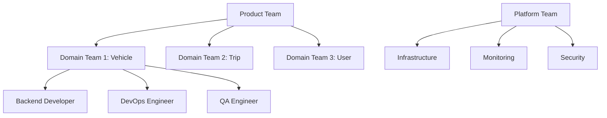

# My Microservices Journey: A Year of Struggles and Discoveries

Hello everyone! Today I want to honestly share my microservices adoption journey over the past year. There might be more failure stories than success stories, but I'm writing this with courage because I think it might help someone out there.

## It started like this: "We've hit some kind of wall"

About two years ago, our team's vehicle data platform started growing, and we began encountering really frustrating situations:

- **30 minutes for one deployment**: I'd go get coffee and it would still be deploying when I came back 😅
- **One error brings down everything**: Getting failure calls at dawn became part of daily life
- **Coordinating schedules with other teams**: We heard "please deploy when our team finishes development" way too often

At first, I thought "this isn't too bad, right?" But as the team grew and services became more complex, I definitely felt the limitations. So we decided to transition to microservices.

## First big mistake: Wrong service decomposition

### I learned too late that you shouldn't split by technology

When we decided to adopt microservices, the first thing we did was figure out "how to split the services?" Initially, I thought really simply:

**How we first split them** (looking back, it was really the wrong approach):
```
❌ database-service (everything DB-related)
❌ api-service (everything API-related)
❌ auth-service (authentication-related)  
❌ notification-service (notification-related)
```

After using this for a few months, it was really frustrating. To add one feature, we had to modify multiple services simultaneously, and ultimately had to deploy them together repeatedly.

**So we changed it to this** (business-centered approach):
```
✅ vehicle-management (everything about vehicle management)
✅ trip-analytics (trip analysis-related)
✅ user-profiles (user profiles)
✅ billing-payments (payment-related)
```

After making this change, each team could develop independently. It made a really big difference!

#### Actual domain decomposition example

```typescript
// Domain decomposition for autonomous driving platform
interface DomainBoundaries {
  vehicleFleet: {
    responsibilities: ['vehicle registration', 'status monitoring', 'firmware management'];
    dataOwnership: ['vehicles', 'sensors', 'diagnostics'];
    apis: ['/vehicles', '/fleet/status', '/diagnostics'];
  };
  
  tripManagement: {
    responsibilities: ['trip creation', 'route optimization', 'real-time tracking'];
    dataOwnership: ['trips', 'routes', 'locations'];
    apis: ['/trips', '/routes', '/tracking'];
  };
  
  userExperience: {
    responsibilities: ['user interface', 'notifications', 'feedback'];
    dataOwnership: ['users', 'preferences', 'feedback'];
    apis: ['/users', '/notifications', '/feedback'];
  };
}
```

### 📊 Data consistency strategy

#### Implementing event sourcing pattern

```typescript
// Event-based data synchronization
interface DomainEvent {
  eventId: string;
  aggregateId: string;
  eventType: string;
  timestamp: Date;
  version: number;
  data: any;
}

class VehicleEventHandler {
  async handleTripCompleted(event: DomainEvent) {
    const { tripId, vehicleId, mileage, fuelConsumption } = event.data;
    
    // 1. Vehicle Service: Update vehicle status
    await this.vehicleService.updateMileage(vehicleId, mileage);
    
    // 2. Analytics Service: Store trip data
    await this.analyticsService.recordTripData({
      tripId, vehicleId, mileage, fuelConsumption
    });
    
    // 3. Billing Service: Publish billing calculation event  
    await this.eventPublisher.publish('billing.calculate', {
      tripId, mileage, userId: event.data.userId
    });
  }
}
```

#### Managing distributed transactions with SAGA pattern

```yaml
# trip-booking-saga.yml
saga:
  name: "TripBookingSaga"
  steps:
    - service: "user-service"
      action: "reserve-credits"
      compensate: "release-credits"
      
    - service: "vehicle-service"  
      action: "reserve-vehicle"
      compensate: "release-vehicle"
      
    - service: "trip-service"
      action: "create-trip"
      compensate: "cancel-trip"
      
    - service: "notification-service"
      action: "send-confirmation"
      compensate: "send-cancellation"
```

## Kubernetes cluster configuration

### 🏗️ Infrastructure architecture

```yaml
# cluster-architecture.yml
apiVersion: v1
kind: ConfigMap
metadata:
  name: cluster-config
data:
  # Production cluster configuration
  nodes: |
    master-nodes: 3 (HA configuration)
    worker-nodes: 12 (auto-scaling)
    
  resources:
    cpu: "48 cores per node"
    memory: "192GB per node"
    storage: "2TB NVMe SSD"
    
  networking:
    cni: "Calico"
    service-mesh: "Istio"
    ingress: "NGINX + Cert-Manager"
```

### 📦 Service-specific deployment configuration

#### 1. High availability service (Vehicle Management)

```yaml
# vehicle-service-deployment.yml
apiVersion: apps/v1
kind: Deployment
metadata:
  name: vehicle-service
  labels:
    app: vehicle-service
    version: v2.1.3
spec:
  replicas: 5
  strategy:
    type: RollingUpdate
    rollingUpdate:
      maxSurge: 2
      maxUnavailable: 1
  selector:
    matchLabels:
      app: vehicle-service
  template:
    metadata:
      labels:
        app: vehicle-service
        version: v2.1.3
    spec:
      containers:
      - name: vehicle-service
        image: myregistry/vehicle-service:v2.1.3
        ports:
        - containerPort: 8080
        env:
        - name: DATABASE_URL
          valueFrom:
            secretKeyRef:
              name: db-credentials
              key: url
        - name: REDIS_URL
          valueFrom:
            configMapKeyRef:
              name: cache-config
              key: redis-url
        resources:
          requests:
            memory: "512Mi"
            cpu: "250m"
          limits:
            memory: "1Gi"
            cpu: "500m"
        livenessProbe:
          httpGet:
            path: /health
            port: 8080
          initialDelaySeconds: 30
          periodSeconds: 10
        readinessProbe:
          httpGet:
            path: /ready
            port: 8080
          initialDelaySeconds: 15
          periodSeconds: 5
---
apiVersion: v1
kind: Service
metadata:
  name: vehicle-service
spec:
  selector:
    app: vehicle-service
  ports:
  - port: 80
    targetPort: 8080
  type: ClusterIP
```

#### 2. HPA (Horizontal Pod Autoscaler) configuration

```yaml
# vehicle-service-hpa.yml
apiVersion: autoscaling/v2
kind: HorizontalPodAutoscaler
metadata:
  name: vehicle-service-hpa
spec:
  scaleTargetRef:
    apiVersion: apps/v1
    kind: Deployment
    name: vehicle-service
  minReplicas: 3
  maxReplicas: 20
  metrics:
  - type: Resource
    resource:
      name: cpu
      target:
        type: Utilization
        averageUtilization: 70
  - type: Resource
    resource:
      name: memory
      target:
        type: Utilization
        averageUtilization: 80
  - type: Pods
    pods:
      metric:
        name: requests_per_second
      target:
        type: AverageValue
        averageValue: "100"
```

## Lessons learned from operational experience

### 💡 Success factors

#### 1. Team structure and organizational alignment



**Leveraging Conway's Law**: Recognizing that organizational structure determines architecture and designing intentionally

#### 2. Gradual migration

```typescript
// Gradual transition with Strangler Fig pattern
class LegacyTripService {
  async createTrip(tripData: TripData): Promise<Trip> {
    // Branch between new/old systems with feature flags
    if (this.featureFlag.isEnabled('NEW_TRIP_SERVICE', tripData.userId)) {
      return this.newTripService.createTrip(tripData);
    } else {
      return this.legacyCreateTrip(tripData);
    }
  }
  
  private async legacyCreateTrip(tripData: TripData): Promise<Trip> {
    // Existing monolithic logic
  }
}
```

#### 3. Observability-first development

```typescript
// Consider metric collection from code writing time
class PaymentService {
  async processPayment(payment: Payment): Promise<PaymentResult> {
    const timer = this.metrics.startTimer('payment_processing_duration');
    
    try {
      this.metrics.increment('payment_attempts_total', {
        payment_method: payment.method,
        amount_range: this.getAmountRange(payment.amount)
      });
      
      const result = await this.paymentGateway.charge(payment);
      
      this.metrics.increment('payment_success_total');
      return result;
      
    } catch (error) {
      this.metrics.increment('payment_failure_total', {
        error_type: error.constructor.name
      });
      throw error;
    } finally {
      timer.end();
    }
  }
}
```

### 🚨 Lessons learned from failures

#### 1. The trap of too-small services

**Problem**: Excessive network calls and complex orchestration

```typescript
// ❌ Over-granular services
interface MicroServices {
  userIdService: 'generates user IDs';
  userNameService: 'manages user names'; 
  userEmailService: 'handles user emails';
  userPhoneService: 'manages phone numbers';
}

// ✅ Right-sized services
interface RightSizedServices {
  userManagementService: 'complete user lifecycle';
  authenticationService: 'login, logout, tokens';
  profileService: 'user preferences, settings';
}
```

#### 2. The danger of distributed monoliths

Distributed but still tightly coupled systems:

- Synchronous call chains between services
- Shared databases
- Need for simultaneous deployment

**Solution**: Introduced event-driven architecture and CQRS patterns

#### 3. The importance of testing strategy

```typescript
// Ensure service compatibility with contract testing
describe('Vehicle Service Contract', () => {
  it('should return vehicle data in expected format', async () => {
    const pact = new Pact({
      consumer: 'trip-service',
      provider: 'vehicle-service'
    });
    
    await pact
      .given('vehicle exists')
      .uponReceiving('a request for vehicle data')
      .withRequest({
        method: 'GET',
        path: '/vehicles/123'
      })
      .willRespondWith({
        status: 200,
        headers: { 'Content-Type': 'application/json' },
        body: {
          id: like('123'),
          status: like('available'),
          location: {
            lat: like(37.5665),
            lng: like(126.9780)
          }
        }
      });
      
    const vehicle = await vehicleClient.getVehicle('123');
    expect(vehicle).toHaveProperty('id');
    expect(vehicle).toHaveProperty('status');
  });
});
```

## Performance measurement and continuous improvement

### 📊 Key performance indicators (KPIs)

#### Technical metrics

| Metric | Target | Current | Improvement |
|--------|--------|---------|-------------|
| Deployment frequency | 5 times/day | 8 times/day | ✅ +60% |
| Deployment lead time | 30 min | 8 min | ✅ -73% |
| MTTR (Mean Time To Recovery) | 1 hour | 15 min | ✅ -75% |
| Change failure rate | <5% | 2.3% | ✅ -54% |

#### Business metrics

- **Service availability**: 99.97% → 99.99%
- **Response time**: P95 500ms → 150ms
- **Concurrent users**: Can handle 10,000 → 100,000 users

### 🔄 Continuous improvement process

```yaml
# Monthly retrospective process
retrospective:
  what_went_well:
    - "Minimized failures with canary deployment"
    - "Quick problem identification with monitoring dashboard"
    
  what_needs_improvement:
    - "Resolve cross-team dependencies"
    - "Expand test automation coverage"
    
  action_items:
    - name: "Expand event-based communication"
      owner: "architecture-team"
      due_date: "2025-02-28"
    - name: "Achieve 80% E2E test coverage"  
      owner: "qa-team"
      due_date: "2025-02-15"
```

## What's next

### 🚀 Next steps roadmap

#### Q1 2025: Platform Engineering enhancement
- **Developer Portal** implementation (Backstage-based)
- **Self-service infrastructure** introduction
- **Developer productivity metrics** collection

#### Q2 2025: AI/ML integration
- **Predictive autoscaling** (machine learning-based)
- **Anomaly detection** automation
- **Performance optimization** AI assistant

#### Q3-Q4 2025: Global expansion
- **Multi-region** architecture
- **Geographic data distribution**
- **Edge computing** adoption

## Practical application guide

### ✅ Step-by-step checklist

#### Design phase
- [ ] Clearly define domain boundaries
- [ ] Separate data ownership
- [ ] Decide communication patterns (sync/async)
- [ ] Plan failure scenarios

#### Development phase  
- [ ] API versioning strategy
- [ ] Standardize logging/metrics
- [ ] Write contract tests
- [ ] Apply security policies

#### Deployment phase
- [ ] Build CI/CD pipeline
- [ ] Canary/blue-green deployment
- [ ] Set up monitoring dashboard
- [ ] Define alert rules

#### Operations phase
- [ ] Define SLA/SLO
- [ ] Failure response playbook
- [ ] Regular disaster recovery training
- [ ] Performance tuning and optimization

### What I really learned (my realizations)

After a year of struggling, here are the most important things I realized:

1. **Don't try to change everything at once**: We were too ambitious at first and really suffered. Changing things one by one slowly is much safer
2. **Start with monitoring**: When something goes wrong, if you can't find the cause, it becomes really overwhelming. Log and metric collection is essential
3. **Team structure needs to change too**: Conway's Law that organizational structure mirrors system structure is really true
4. **Invest in automation**: When you have many services, you absolutely can't manage them manually

### Honest confession

Microservices isn't a magic solution that solves all problems. Sometimes it brings new complexity, and sometimes monoliths might be a better choice.

But if you adopt it properly, it can really improve team productivity and system stability. Our team also had a hard time, but we're really satisfied now.

If you're considering adopting microservices, feel free to ask questions anytime. I think I can share the struggles I went through in advance! 😊

---

**Next, we'll share these stories:**
- Performance optimization tips I learned while operating Kubernetes (planned for next week)
- Thoughts on whether event-driven architecture is really necessary (around February)

**If you want to discuss more:**
- Contact me on LinkedIn: [linkedin.com/in/jaylee](https://linkedin.com/in/jaylee)
- Meet me on GitHub: [github.com/jayleekr](https://github.com/jayleekr)